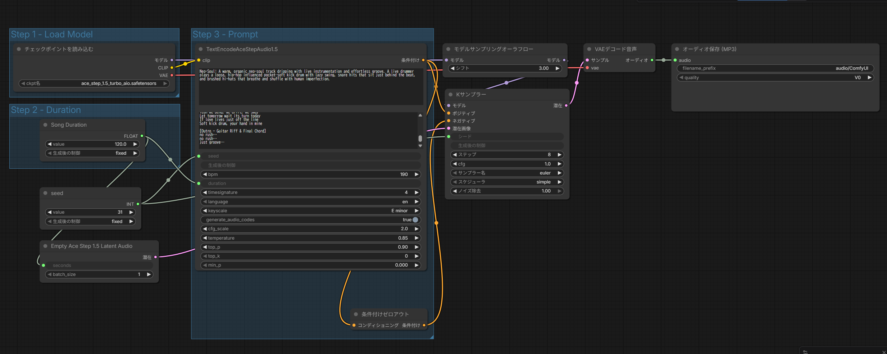

# ACE Step 1.5 Simple Workflow

## 概要
ComfyUIのテンプレート「ACE Step 1.5 Turbo AIO」を用いて、音楽を生成してみた。
---

## ワークフロー（デフォルト）


---
## 使用モデル
- ace_step_1.5_turbo_aio

---
## 実行結果
### 例１：j-pop femail
#### プロンプト
- TextEncodeAceStepAudio1.5
1. tags(上段)：曲のスタイルを指定（ジャンル、楽器、ムード、テンポ感など）
```
j-pop, upbeat,female vocalist, sweet voice, synth pop, electronic, piano, bass, drums, cheerful, 128 bpm, major key, catchy melody, bright production
```
2. lyrics(下段)：歌詞と楽曲構成（[Verse] [Chorus] など）を指定
```
[Verse]
朝の光が差し込んで
新しい一日が始まる
昨日までの悩みなんて
風に乗せて飛ばそう

[Chorus]
走り出せ　どこまでも
この空の下で
夢を追いかけて
笑顔で進もう

[Bridge]
雨の日も晴れの日も
ずっと一緒にいよう

[Outro]
La la la la la...
```
#### 音楽制御パラメータ
- bpm：190
- language：en
- keyscale：E minor
- timesignature：4
- seed：31
- song duration：120.0

#### LM（言語モデル）制御パラメータ
- generate_audio_codes：true（true推奨）
- cfg_scale（プロンプト追従度）：2.0
- temperature（多様性、高いほど変化大）：0.85
- top_p：0.90
- top_k：0
- min_p：0.000 

#### 出力結果
[▶ 音声を再生する](music/sample1.mp3)

---
### 例２：rock and hiphop
#### プロンプト
- TextEncodeAceStepAudio1.5
1. tags(上段)：曲のスタイルを指定（ジャンル、楽器、ムード、テンポ感など）
```
Start with soft strings, middle becomes noisy dynamic metal rock, end turns to hip-hop
```
2. lyrics(下段)：歌詞と楽曲構成（[Verse] [Chorus] など）を指定
```
[Intro - piano]

[Verse 1]
朝の光が差し込んで
新しい一日が始まる
昨日までの悩みなんて
風に乗せて飛ばそう

[Pre-Chorus]
まだ見ぬ景色が待ってる
一歩踏み出すだけでいい

[Chorus - anthemic]
走り出せ　どこまでも
この空の下で
夢を追いかけて
笑顔で進もう

[Verse 2]
雨上がりの虹を見た
涙の後に見える光
立ち止まっていた時間が
動き出す合図だね

[Bridge - whispered]
雨の日も晴れの日も
ずっと一緒にいよう

[Final Chorus - anthemic]
走り出せ　どこまでも
この空の下で
夢を追いかけて
笑顔で進もう (oh oh oh)

[Outro - fade out]
La la la la la...
```
#### 音楽制御パラメータ
- bpm：190
- language：en
- keyscale：E minor
- timesignature：4
- seed：31
- song duration：150.0 ←変更！

#### LM（言語モデル）制御パラメータ
- generate_audio_codes：true（true推奨）
- cfg_scale（プロンプト追従度）：2.0
- temperature（多様性、高いほど変化大）：0.85
- top_p：0.90
- top_k：0
- min_p：0.000 

#### 出力結果
[▶ 音声を再生する](music/sample2.mp3)

---
