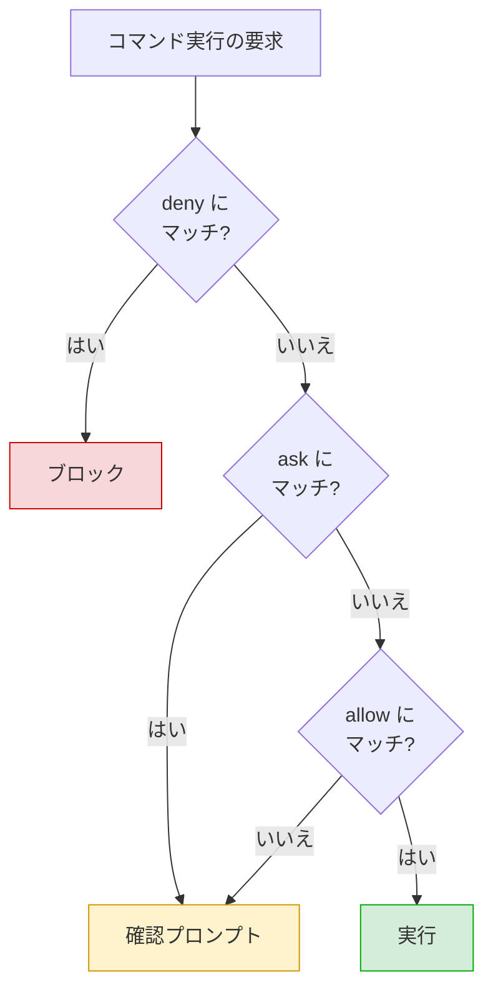
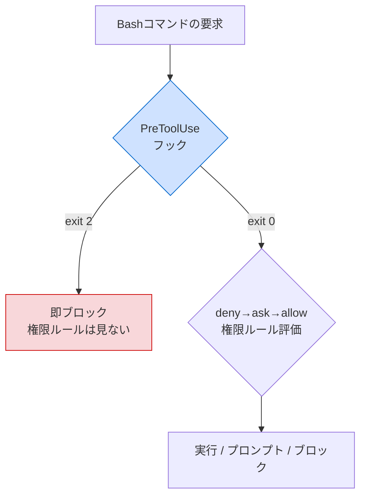
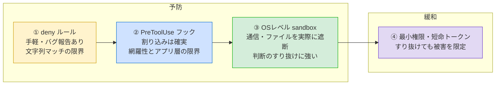

# Claude Code で「危険なコマンドを実行させない」設定ガイド

開発者向け共有ドキュメント
（別紙『LLMエージェントに `gh` コマンドを運用させる際のトークン流出リスクと対策』の**予防策（入口）**を、Claude Code 固有の実装に落とし込んだもの）

---

## 0. このドキュメントの位置づけ

別紙では、防御を **予防（流出を起こさせない）** と **緩和（起きても影響を小さくする）** の2カテゴリで整理した。本書はそのうち予防、特に **「そもそも危険なコマンドを実行させない（入口）」** を Claude Code でどう実現するかに絞る。

最初に全体像と結論:

- 第一の道具は `settings.json` の **`permissions` deny ルール**。手軽だが**限界がある**。
- 限界を埋めるのが **PreToolUse フック**。権限ルールより先に走り、`exit 2` で確実に割り込める。
- ただしどちらも**アプリケーションレベル**の防御。すり抜けに本当に強いのは **OSレベルの sandbox**。
- → 「deny ルール × フック × sandbox」を重ね、最後に別紙の緩和策（最小権限・短命トークン）で被害を抑える。

> **大原則:** 「`settings.json` に deny と書いたからもう安全」と考えるのが最も危険。各層に既知の穴があるため、必ず重ねる。

---

## 1. 設定をどこに書くか

`permissions` は次のファイルに書ける。チーム共有するならプロジェクト単位（git管理）、個人の全プロジェクトに効かせるならユーザー単位を使う。

| 配置 | パス | 用途 | git管理 |
|------|------|------|---------|
| Managed（組織） | OS依存の管理パス | 組織ポリシー。**上書き不可** | 管理者配布 |
| Local project | `.claude/settings.local.json` | 個人のプロジェクト設定 | gitignore推奨 |
| Shared project | `.claude/settings.json` | **チーム共有設定** | コミットする |
| User | `~/.claude/settings.json` | 全プロジェクトに適用 | – |

**優先順位（強い順）:** Managed → コマンドライン引数 → Local project → Shared project → User。
重要な性質として、**ある層で deny されたら、他のどの層でも allow に戻せない**。deny はどのスコープにあっても allow より先に評価される。

---

## 2. ルールの評価順序

### 3種のルールとは

`permissions` に書けるルールは `deny` / `ask` / `allow` の3種類。それぞれ「マッチしたコマンドをどう扱うか」を定める。

| ルール | 意味 | マッチしたコマンドの挙動 |
|--------|------|--------------------------|
| **allow** | 許可 | 手動承認なしで**そのまま実行**する。確認プロンプトを出さない |
| **ask** | 確認 | 実行しようとするたびに**確認プロンプトを出し**、ユーザーの承認を待つ |
| **deny** | 禁止 | そのツール／コマンドの使用を**ブロック**する |

`allow` は「いちいち聞かずに通してよい安全なコマンド」、`ask` は「実行前に人間の判断を挟みたいコマンド」、`deny` は「そもそも使わせたくないコマンド」を指定する、と捉えると分かりやすい。

なお、どのルールにもマッチしなかったコマンドは、デフォルトのモード（通常は「初回使用時に確認プロンプト」）にフォールバックする。つまり「allow に入れていない＝即ブロック」ではなく、多くの場合は確認を求められる挙動になる（モード設定により変わる）。

### 評価の順序

3種のルールは **deny → ask → allow** の順で評価され、**最初にマッチしたルールが勝つ**。deny が常に最優先。

そのため、同じコマンドが allow と deny の両方にマッチする場合でも、**deny が勝ってブロックされる**。「許可と禁止が衝突したら禁止が優先」と覚えておけばよい。



deny の書き方には2系統あり、効き方が違う。

| 書き方 | 例 | 効果 |
|--------|----|----|
| ツール名のみ | `Bash` | そのツールを**Claudeのコンテキストから消す**（Claudeはツールの存在自体を見ない） |
| スコープ付き | `Bash(rm *)` | ツールは使えるが、**マッチする呼び出しだけブロック** |

---

## 3. 基本設定 — トークン露出系を deny する

まずは宣言的ルールでの最小構成。`.claude/settings.json` に置く。

```json
{
  "permissions": {
    "deny": [
      "Bash(gh auth token*)",
      "Bash(env*)",
      "Bash(printenv*)",
      "Bash(echo $GH_TOKEN*)",
      "Bash(echo $GITHUB_TOKEN*)",
      "Read(.env)",
      "Read(.env.*)",
      "Read(~/.config/gh/**)"
    ]
  }
}
```

ブロック対象の意図は別紙「現実的な流出経路」と対応する。

| deny ルール | 防ぎたい経路 |
|-------------|--------------|
| `Bash(gh auth token*)` | トークンを標準出力へ明示的に吐く |
| `Bash(env*)` / `Bash(printenv*)` | 環境変数からトークンが丸見えになる |
| `Bash(echo $GH_TOKEN*)` 等 | 変数展開での露出 |
| `Read(.env)` / `Read(.env.*)` | 秘密ファイルの読み取り |
| `Read(~/.config/gh/**)` | 平文 `hosts.yml` の読み取り |

ただし、この宣言的ルールだけでは塞ぎきれない。以下の落とし穴を必ず理解しておく。

---

## 4. 4つの落とし穴

### 落とし穴① — `Read` の deny はシェル経由のサブプロセスに及ばない

`Read(.env)` は Claude Code の組み込み Read ツールと、`cat`・`head`・`tail`・`sed` など**Claude Codeが認識する一部のBashファイルコマンド**は止める。しかし **Python や Node スクリプトのように間接的にファイルを読む任意のサブプロセスには適用されない**。

```bash
cat .env                              # ← Read deny で止まる
python -c "print(open('.env').read())" # ← Read deny では止まらない（素通り）
```

**対策:** `Read` deny と `Bash` deny を**セットで書く**。完全な遮断が必要なら sandbox（後述）を使う。

### 落とし穴② — 引数を縛る Bash パターンは脆い

`Bash(curl github.com/*)` のように「コマンド本体だけでなく**引数の中身まで**条件にする」書き方は、ほぼ確実に回避される。permission ルールは**コマンド文字列の前方一致＋ワイルドカード**でしかなく、同じ意味のコマンドが無数の書き方で表現できるため。

```bash
# ルール: Bash(curl github.com/*) を想定
curl -X GET github.com/foo     # オプションが先 → マッチしない
curl https://github.com/foo    # https:// が挟まる → マッチしない
curl -L http://bit.ly/xyz      # リダイレクトでGitHubへ → 文字列上はGitHubですらない
URL=github.com; curl $URL      # 変数経由 → 実行時まで中身不明
curl  github.com/foo           # スペース2個 → 1文字違いでマッチしない
```

| 縛り方 | 例 | 評価 |
|--------|----|----|
| **本体だけ縛る** | `Bash(curl*)` を deny | 堅い。書き方に関係なく `curl` を全面禁止 |
| **引数を縛る** | `Bash(curl github.com/*)` | 脆い。書き方の変種で素通り |

**対策:** 「どのコマンドを使えるか」はパターンで縛れるが、「どこへ接続してよいか」はパターンに向かない。
→ `curl`・`wget` は**本体ごと deny で全面禁止**し、接続先の制御は **WebFetch のドメイン許可** か **OSレベル sandbox の egress 制限**で行う。
※注意：WebFetch を使うだけではネットワークは塞げない。Bash が許可されていれば `curl` 等で任意URLに到達できるので、ネットワークツールの deny と必ずペアにする。

### 落とし穴③ — 複合コマンドとラッパー

ここは Claude Code が比較的よくできている部分と、抜け道が混在する。

| 挙動 | 内容 | 結果 |
|------|------|------|
| 複合コマンド | `&&`・`||`・`;`・`|` 等で分割し、**各サブコマンドが独立してマッチを要求**される | `safe-cmd && rm -rf .` は `rm` 側で止まる（堅い） |
| 一部ラッパーは剥がす | `timeout`・`time`・`nice`・`nohup`・`stdbuf` は事前に除去してマッチ | `timeout 30 npm test` も `Bash(npm test*)` で扱える |
| 環境ランナーは**抜ける** | `npx`・`docker exec`・`direnv exec` 等はラッパー扱いされない | `Bash(devbox run *)` は `devbox run rm -rf .` まで許可してしまう |

**対策:** 環境ランナー経由の実行は、ランナーと内側コマンドを含めた**具体的なルール**を1つずつ書く。deny を過信せずフック・sandbox で重ねる。

### 落とし穴④ — 宣言的ルールが効かない既知のバグ報告

`settings.json` の `allow` / `deny` の Bash ルールが**確実には強制されない**ケースがコミュニティから報告されている（パイプを含むコマンドで allow が効かない、等）。報告では回避策として **PreToolUse フックの自作**が挙げられている。

不具合の「方向」で深刻さが違う点に注意:

| 壊れ方 | 内容 | 危険度 |
|--------|------|--------|
| allow が効かない | 許可したのに止められる（過剰ブロック） | 低（煩わしいだけ・安全側） |
| **deny が効かない** | 禁止したのに実行できてしまう | **高（予防に穴）** |

**対策:** 「deny に書いた＝絶対安全」と考えない。`/permissions` で現在有効なルールを確認し、deny したコマンドを実際に試してブロックされるか**実機検証**する。そのうえでフックで補強する。

---

## 5. PreToolUse フック — 宣言的ルールの限界を埋める

### 仕組み

PreToolUse フックは、ツール呼び出しの**権限ルールが評価される前**に走るスクリプト。終了コードで判定を返す。

- `exit 0` … 通してよい
- `exit 2` … **ブロックしろ**（権限ルールの評価前に即停止）



この順序のため、**フックの `exit 2` は allow ルールを上書きできる**。例えば `allow` に `Bash(gh *)` があり `gh auth token` が本来通るはずでも、フックが先に止めれば allow に到達しない。

### 推奨パターン：「広く許可 × 危険物だけ遮断」

毎回の確認が煩わしい場合、allow で広く開けつつ、危険な数個だけフックで狙い撃ちする運用が公式でも勧められている。

```json
{
  "permissions": { "allow": ["Bash"] },
  "hooks": {
    "PreToolUse": [
      {
        "matcher": "Bash",
        "hooks": [
          { "type": "command", "command": "$CLAUDE_PROJECT_DIR/.claude/hooks/block-secrets.sh" }
        ]
      }
    ]
  }
}
```

フック本体の骨格（コマンド文字列を受け取り、危険パターンなら `exit 2`）:

```bash
#!/usr/bin/env bash
# .claude/hooks/block-secrets.sh
input=$(cat)
cmd=$(echo "$input" | jq -r '.tool_input.command // empty')

if echo "$cmd" | grep -Eq 'gh auth token|printenv|(^|[^A-Za-z])env([^A-Za-z]|$)|\$GH_TOKEN|\$GITHUB_TOKEN|cat .*hosts\.yml'; then
  echo "Blocked: potential token exposure command" >&2
  exit 2
fi
exit 0
```

`matcher` で対象ツールを絞れる（上記は `Bash` のときだけ発火。Read や WebFetch では動かない）。

---

## 6. フックの位置づけと限界

フックは宣言的ルールより信頼できるが、**「確実」ではない**。過信は禁物。

**強み**
- 権限ルールより先に、`exit 2` で確実に割り込める（allow を上書きできる）
- コマンド文字列を任意ロジックで検査でき、正規表現で変種をまとめて潰せる

**限界**
- **検査ロジックの網羅性に依存**：書いたパターンしか捕まらない。変数経由（`X=token; gh auth $X`）や別名・別経路を入れ忘れれば素通り（落とし穴②と同根）
- フック自体にも環境依存の不具合報告がある → **実機検証必須**
- あくまで**アプリケーションレベル**：Claude Code がツール呼び出しを解釈する段で割り込むにすぎず、許可されたコマンドの内側でサブプロセスが何をするかまでは見られない

---

## 7. パフォーマンス（フックは遅くなるか）

軽いフックなら**体感上ほぼ問題にならない**。

- フック未登録時、多くの Bash コマンドは**人間の確認プロンプト待ち**になる。人が読んでEnterを押す数秒に比べ、スクリプトの数ミリ秒は誤差。自動判定でむしろ**速くなる**ことが多い
- `grep` 一発の検査なら通常ミリ秒オーダー
- そもそも律速は**モデルとの通信（推論）**。1ステップ数秒の隣で、フックの数ミリ秒は無視できる

**遅くなるのは「重いフック」を毎コマンド走らせたとき：**

| 重くなる例 | 対処 |
|------------|------|
| フック内でネットワークアクセス（外部APIで判定） | 同期の軽い処理に留める |
| 重いランタイムを毎回起動（フルロードのPython等） | 起動コストの低い実装にする |
| 小さなLLMを呼んで安全性判定 | 高頻度フックでは避ける |

**指針:** 毎コマンド走るフック（`Bash` matcher 等）は**軽い同期処理**に留める。トークン保護目的なら grep 一発で十分。

---

## 8. 多層防御の中での位置づけ

本書が扱うのは予防の入口。信頼度には序列があり、単層に頼らない。



| 層 | 種別 | 強さ | 役割 |
|----|------|------|------|
| ① deny ルール | アプリ（予防・入口） | 弱〜中 | 手軽な一次防御 |
| ② PreToolUse フック | アプリ（予防・入口） | 中 | ①の穴を埋める。allowを上書き |
| ③ OSレベル sandbox | OS（予防・出口） | 強 | プロンプトインジェクションが判断をすり抜けても、Bashの境界外アクセスを遮断 |
| ④ 最小権限・短命PAT | 緩和 | – | すり抜けられても被害を最小化（別紙参照） |

permission ルールはアプリケーションレベルのブロック、sandbox はプロンプトインジェクションが Claude の判断をすり抜けても Bash の境界外到達を防ぐ OSレベルの強制であり、**両者を組み合わせて多層防御にする**のが公式の方針。

---

## 9. 推奨構成（まとめ）

トークン保護を目的に、Claude Code で「実行させない」を組むときの実践手順。

1. **deny ルールを置く（§3）** — Bash と Read を**セット**で。引数縛りは避け、ネットワークツールは本体ごと deny。
2. **PreToolUse フックで補強（§5）** — 「広く許可 × 危険物だけ `exit 2`」。軽い grep 検査に留める。
3. **OSレベル sandbox を有効化（§8）** — egress 制限。アプリ層をすり抜けても効く最も堅い層。
4. **実機検証（§4 落とし穴④）** — deny / フックが実際に効くか、禁止コマンドを試して確認。
5. **緩和策を併用（別紙）** — fine-grained PAT の最小権限・短命化。すり抜けても被害を限定。

> deny ルールは「手軽な一次防御」、フックは「その穴を埋める一段」、sandbox は「判断のすり抜けに強い最後の砦」。どれも単独では穴があるため、必ず重ねる。

---

## 付録：用語

- **PreToolUse フック**：ツール実行前・権限ルール評価前に走るスクリプト。`exit 2` でブロック。
- **終了コード（exit code）**：スクリプト終了時の数値。`0`=正常、`2`=ブロックの合図。
- **matcher**：フックが反応するツールの指定（例：`Bash`）。
- **引数を縛る**：コマンド本体だけでなく引数の中身まで条件にすること。文字列マッチでは脆い。
- **sandbox**：OSレベルでBashのファイル/ネットワークアクセスを制限する仕組み。判断のすり抜けに強い。
- **managed settings**：組織が配布する上書き不可の設定。
