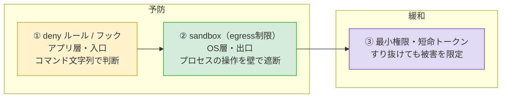
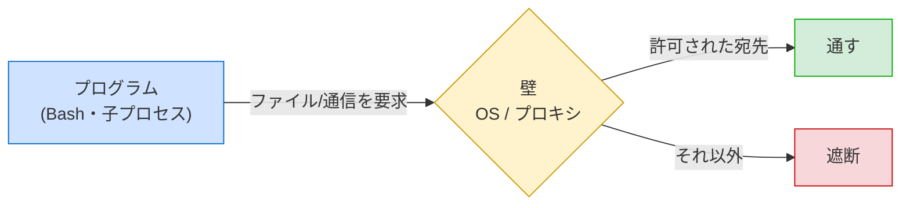
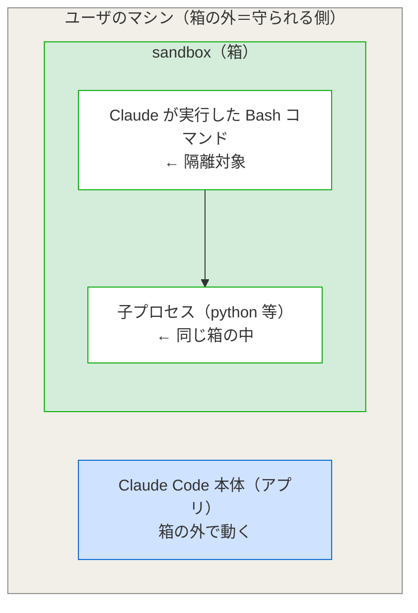

# Claude Code で「実行されても外に出させない」設定ガイド（egress制限 / sandbox）

開発者向け共有ドキュメント
（別紙『LLMエージェントに `gh` コマンドを運用させる際のトークン流出リスクと対策』の**予防策（出口）**、および『Claude Code で「危険なコマンドを実行させない」設定ガイド』の続編。前者を「入口」、本書を「出口」として対にする）

---

## 0. 用語の説明（先に読む）

本書を読む前に、混同しやすい用語を定義しておく。

| 用語 | 意味 |
|------|------|
| **egress（イグレス）** | 「外向き・出ていく」の意。ネットワークでは**マシンやプロセスから外部へ出ていく通信**を指す（逆向きの入ってくる通信は ingress） |
| **egress制限** | 「外向き通信を制限する」という**目的・概念**。トークン等を取得されても、それを外部へ持ち出す通信を絞ることで流出を防ぐ |
| **sandbox（サンドボックス）** | 元は子どもの「砂場」。中で何をしても外に影響しない隔離区画の比喩。ソフトウェアでは**プログラムを制限された箱の中で動かし、箱の外のリソース（ファイル・ネットワーク・他プロセス）への操作をOSレベルの壁で強制的に制限する仕組み** |
| **OSレベルの強制** | アプリ自身の判断ではなく、OS（基盤ソフト）がプロセスの実際の操作を境界で受け止めて止めること。アプリの判断のすり抜けに強い |
| **プロキシ** | 通信を中継するサーバ。sandbox のネットワーク制限は、箱の外に置いたプロキシが通信先を判定して通す／弾くことで成立する |
| **TLS** | HTTPS通信の暗号化。「TLSを終端・検査する」とは、暗号を一度ほどいて中身を見ること。しないと宛先ホスト名しか分からない |
| **allowlist / denylist** | 許可リスト／拒否リスト。allowlist は「これだけ許す」、denylist は「これだけ禁じる」 |
| **escape hatch（退避口）** | sandbox 内で実行できないコマンドを、例外的に箱の外で実行させる仕組み。便利だが封じ込めの穴になりうる |
| **fine-grained PAT** | GitHub の細粒度パーソナルアクセストークン。対象リポジトリと権限を細かく絞れる |

### egress制限 と sandbox の関係（重要）

両者はイコールではない。**包含関係**にある。

```
sandbox（箱：隔離の仕組み）
 ├─ ファイルシステムの制限（触れるファイルを限定）
 └─ ネットワークの制限  ← これが egress制限
```

- egress制限は、sandbox が提供する機能の**一部**（ネットワーク側）。
- Claude Code で egress制限を実装する標準的な手段が、この sandbox のネットワーク隔離。
- ただし egress制限は sandbox 以外（Dockerのネットワーク遮断、OSファイアウォール、企業プロキシ等）でも実現できる。Claude Code 内蔵 sandbox は「手軽な一手段」。
- **実効的な sandbox には、ファイルとネットワークの両隔離が必要**。ネットワークだけ締めてファイルを開けっ放しにすると、SSH鍵などを読めてしまい片手落ちになる。そのため本書はネットワークと並行してファイル側の設定も扱う。

---

## 1. 本書の位置づけ — 多層防御のどこか

別紙では防御を **予防（流出を起こさせない）** と **緩和（起きても影響を小さくする）** に分けた。本書が扱う egress制限 / sandbox は、予防のうち「出口」にあたる。



入口（前編：deny／フック）はコマンド文字列を見て判断するアプリレベルの防御で、文字列マッチの抜け道がある。sandbox は層が違い、OSが走っているプロセスの操作そのものを壁で止めるため、**モデルの判断がプロンプトインジェクション等ですり抜けても効く**。さらにOSレベルの境界は**子プロセスにも継承される**ので、`python -c "..."` のような別プロセス経由の回避にも強い。これが「最後の砦」と呼ぶ理由。

---

## 2. sandbox の仕組み（概念図）

箱の中のプログラムが外部リソースへアクセスしようとすると、箱の壁（OS／プロキシ）が判定し、許可された宛先だけ通し、それ以外は遮断する。



判定の主体が「アプリの文字列チェック」ではなく「OSの境界」である点が、入口の防御との決定的な違い。

---

## 3. 実装手順

トークン保護を目的とした、Claude Code での具体的な設定手順。

### ステップ0：sandbox を有効にする

`/sandbox` でパネルを開くか、全プロジェクトに効かせるなら `~/.claude/settings.json` に記述する。

```json
{
  "sandbox": { "enabled": true }
}
```

環境ごとの準備:

| 環境 | 準備 |
|------|------|
| macOS | Seatbelt を使用。**追加インストール不要** |
| Linux / WSL2 | `bubblewrap` と `socat` が必要（例：`sudo apt-get install bubblewrap socat`） |
| ネイティブ Windows | **非対応**。WSL2 上で動かす |

### ステップ1：ネットワークを絞る（egress制限の本体）

デフォルトは事前許可ドメインがゼロで、新しい宛先のたびに承認を求められる。定常的に使う宛先だけを `allowedDomains` で最小限に開ける。

```json
{
  "sandbox": {
    "enabled": true,
    "network": {
      "allowedDomains": ["github.com", "api.github.com"]
    }
  }
}
```

> **最大の落とし穴（TLS非検査）：** プロキシは申告されたホスト名で判定するだけで TLS を終端・検査しない。そのため `github.com` のような広い許可は、それ自体がデータ持ち出しの経路（domain fronting 等）になりうる。
> 対策：許可ドメインは「本当に要るものだけ」に絞る。強い保証が必要なら、TLSを終端・検査する**カスタムプロキシ**（`network.httpProxyPort` 設定）まで踏み込む。

### ステップ2：ファイルシステム側で資格情報を遮断する

sandbox のデフォルト読み取りポリシーは緩く、`~/.aws/credentials` や `~/.ssh/` を**まだ読めてしまう**。egress を絞ってもファイルが読めては片手落ちなので、明示的に遮断する。

```json
{
  "sandbox": {
    "enabled": true,
    "filesystem": {
      "denyRead": ["~/.aws", "~/.ssh", "~/.config/gh"]
    }
  }
}
```

### ステップ3：環境変数からトークンを外す

sandbox 内のコマンドは親プロセスの環境変数を継承する。`GH_TOKEN` を env に置くと箱の中からも見える。

- **env にトークンを置かない**（Keychain 認証にする）のが最も確実。
- 補助的に `CLAUDE_CODE_SUBPROCESS_ENV_SCRUB` で子プロセスから資格情報を除去できる。ただし主対象は Anthropic／クラウド系の資格情報なので、`GH_TOKEN` のような独自トークンは「env に置かない」設計で対処する。

### ステップ4：退避口（escape hatch）を塞ぐ

sandbox 制限でコマンドが失敗すると、`dangerouslyDisableSandbox` を付けて箱の外で再試行されることがある。封じ込めを厳格にするなら無効化する（組織強制なら managed 設定へ）。

```json
{
  "sandbox": {
    "enabled": true,
    "failIfUnavailable": true,
    "allowUnsandboxedCommands": false
  }
}
```

| キー | 意味 |
|------|------|
| `failIfUnavailable: true` | sandbox を起動できなければ Claude Code 自体を起動させない |
| `allowUnsandboxedCommands: false` | 箱の外への再試行（退避口）を許さない（Strict sandbox mode） |

### ステップ5：macOS で `gh` が箱の外に出ていないか確認する

macOS 特有の罠。`gh`・`gcloud`・`terraform` などの Go 製 CLI は Seatbelt 下で TLS 検証に失敗しがちで、その場合 `excludedCommands`（sandbox 外で実行するリスト）に入れる案内になる。**封じ込めたい当の `gh` が箱の外に出ると、egress制限が `gh` に効かない**。

- 自分の `excludedCommands` に `gh` が入っていないか確認する。
- TLS問題で除外せざるを得ない場合は、MITMプロキシ＋カスタムCAを用いて `enableWeakerNetworkIsolation` を立てる選択肢がある（トレードオフあり）。その場合はステップ6の緩和策をより強く効かせる前提で運用する。

### ステップ6：緩和策を必ず併用する

ステップ1のTLSジレンマやステップ5の `gh` 除外問題がある以上、**egress制限単独でトークン流出を完全に防ぐのは難しい**。別紙の緩和策を必ず重ねる。

- `gh` に渡すトークンを **fine-grained PAT** にし、対象リポジトリと権限を最小化。
- 可能なら **GitHub App の短命トークン**（約1時間で失効）。
- **エージェント専用**にトークン／アカウントを分離。

→ すり抜けて持ち出されても被害が限定される。

---

## 4. 設定まとめ（macOS 想定の最小例）

```json
{
  "sandbox": {
    "enabled": true,
    "failIfUnavailable": true,
    "allowUnsandboxedCommands": false,
    "network": {
      "allowedDomains": ["github.com", "api.github.com"]
    },
    "filesystem": {
      "denyRead": ["~/.aws", "~/.ssh", "~/.config/gh"]
    }
  }
}
```

優先順位:

1. sandbox 有効化 → ネットワークとファイルを絞る（ステップ0〜2）
2. env と退避口を締める（ステップ3〜4）
3. macOS なら `gh` の除外を確認（ステップ5）
4. **必ず緩和策と併用**（ステップ6）

---

## 5. 動作確認

設定後、実際に効くかを検証しておく。

| 確認内容 | 期待する挙動 |
|----------|--------------|
| sandbox 内から許可外ドメインへ `curl` | ブロックされる |
| `cat ~/.ssh/id_rsa` を試す | 読み取り拒否される |
| 許可ドメイン（例：github.com）への通信 | 成功する |
| `gh` コマンドの実行 | sandbox 内で動く（excludedCommands に落ちていない） |

---

## 6. sandbox の限界（過信しない）

Claude Code の sandbox は便利だが、**完全な隔離境界ではない**。本書で触れた穴を再掲する。

| 限界 | 内容 |
|------|------|
| TLS非検査 | 広いドメイン許可が持ち出し経路になりうる（ステップ1） |
| 環境変数の継承 | env のトークンが箱の中から見える（ステップ3） |
| デフォルト読み取りが緩い | 資格情報ファイルが既定で読める（ステップ2） |
| 退避口 | 箱の外での再試行余地（ステップ4） |
| Go製CLIの除外 | macOS で `gh` 等が箱の外に出がち（ステップ5） |

→ これらがある以上、egress制限は**単独で完結させず**、入口（前編：deny／フック）と緩和（最小権限・短命トークン）と必ず重ねる。これが一貫した結論。

---

## 7. 深掘り：TLS非検査の落とし穴を正しく理解する

§3 ステップ1で「最大の落とし穴」とした TLS非検査は、誤解されやすいので本質を掘り下げる。結論を先に言うと、問題は「中身が見えないこと」そのものではなく、**プロキシが宛先の申告を信じるしかなく、その宛先の信頼が崩れると守りが崩れる**ことにある。

### 7-1. TLS（HTTPS）とは何をしているか

TLS は HTTPS通信の暗号化の仕組み。マシンとサーバ間でやり取りされる中身を、第三者が覗いても読めないよう暗号化する。重要なのは、暗号化されていると**間に立つ者には「中身」が見えない**こと。見えるのは「どこへ繋ごうとしているか（申告された宛先ホスト名）」程度で、送られるデータの中身は暗号の中に隠れる。

### 7-2. 標準プロキシは「宛先」だけで判定している

sandbox のネットワーク制限は、箱の外のプロキシが「この通信先は許可リストにあるか」を判定して通す／弾く仕組み。このプロキシは TLS を終端・検査しない（＝暗号をほどいて中を見ない）ため、判定に使える情報が限られる。

| プロキシが見ているもの | プロキシが見ていないもの |
|------------------------|--------------------------|
| 「これから github.com に繋ぐ」という**自己申告の宛先ホスト名** | 暗号化された通信の**中身**（何を送るか） |
| | **本当にその宛先に繋がっているのか** |

つまり、申告された宛先を額面どおり信じるしかない状態。

### 7-3. 「中身でブロック」は標準プロキシの仕事ではない

ありがちな誤解：「暗号化された中にトークンが含まれていたらブロックできないのか？」
→ 標準プロキシは**そもそも中身を見て弾く仕組みではない**。トークンが入っていようがいまいが中身は見ていない。中身検査でなく、**宛先で絞る**ことが本来の守り方。

```
健全な動き（宛先で止める）:
  トークンを攻撃者サーバ(evil.com)へ送ろうとする
        ↓
  evil.com は許可リストにない
        ↓
  宛先で弾かれる ← 中身は見ていないが、出口で止まる
```

健全に動いていれば、中身を見なくても宛先を絞ることで持ち出しを防げる。

### 7-4. 本当の落とし穴は「宛先の偽装」

問題は「中身が見えないから検知できない」ことではなく、**宛先の申告そのものを偽装される**こと。プロキシは中身を見ないので申告を信じるしかなく、`github.com` のような許可済みドメインを表向き名乗りつつ、実際には別サーバへ届ける手法（domain fronting 等）ですり抜けられる。

```
すり抜けの動き（宛先の偽装）:
  表向き「github.com へ送る」と申告（github.com は許可済み）
        ↓
  プロキシは中身を見ないので申告を信じて通す
        ↓
  実際には別サーバへトークンが届く ← 宛先偽装で許可リストを迂回
```

たとえると、中身の見えない封筒に「宛先：GitHub」と書いてあれば検問所（プロキシ）は信じて通す。封筒の中の本当の指示書には別の住所が書いてあっても、封を開けない（＝TLSを検査しない）ので見破れない。

### 7-5. だから「広いドメイン許可は危険」

危険な経路は2種類あり、根は同じ（プロキシは宛先の申告を信じるしかない）。

| 経路 | 内容 |
|------|------|
| 直接的 | 許可リストを広げすぎ、その範囲に攻撃者のホストが紛れ込む（攻撃者サーバを自分でリストに入れてしまう） |
| 間接的 | 正規の宛先（github.com）しか許可していなくても、申告の偽装（domain fronting）で迂回され、結果的に攻撃者サーバへ届く |

許可ドメインを絞るほど「名乗って通れる宛先」が減り、すり抜けの土俵が小さくなる。ゆえに「広いドメイン許可ほど持ち出しの危険が高まる」。

### 7-6. TLS終端プロキシを入れるとどう変わるか

「TLSを終端・検査するカスタムプロキシ」を入れると**中身まで開けて見られる**ようになり、2つの効果が出る。

- **宛先の偽装を見破れる**：本当の宛先・中身を確認できるので、「github.comと名乗って実は別所」が効かなくなる。
- **中身そのものでの検査が可能になる**：トークンらしき文字列が出ていく通信を弾く（DLP的なこと）が技術的に可能に。

> まとめ：標準構成の守りは「**宛先の表札は確認するが、荷物の中身は開けない検問所**」。表札確認だけで足りない脅威モデルなら、中身まで開ける検問所（TLS終端プロキシ）が要る。いずれにせよ守りの軸は「宛先を信じてよいか」に集約され、最終的には緩和策（最小権限・短命トークン）で「すり抜けられても困らない」状態を併せて作る。

---

## 8. 補足：sandbox は「何を」隔離しているのか

「sandbox は Claude Code を隔離するのか／ユーザのマシンを隔離するのか」は誤解しやすい。結論から言うと、どちらの言い方も不正確。

### 隔離対象は「Claude が実行する Bash コマンドとその子プロセス」

sandbox が箱に入れているのは、Claude Code というアプリ本体でもマシン全体でもなく、**Claude が実行する個々の Bash コマンドのプロセス（とそこから派生する子プロセス）**。sandbox の境界は Bash コマンドとその子プロセスにのみ適用される。



### 「マシンを隔離」ではなく「マシンを守るためにコマンドを閉じ込める」

方向で捉えると正確になる。

| | 役割 |
|---|---|
| 制限を受ける（隔離される）側 | Claude が実行するコマンド |
| 守られる側 | マシンのそれ以外（ホームディレクトリ、SSH鍵、他プロセス、ネットワーク等） |

→ マシンは**隔離される対象ではなく、保護される対象**。マシンを守るために、その中で動く「危ないかもしれないコマンド」のほうを箱に閉じ込めている。

### 注意：箱の壁は思うより薄い

Docker コンテナや VM のような強い隔離を想像しがちだが、内蔵 sandbox の壁はそこまで強固ではない。特にデフォルトの読み取りポリシーは緩く、箱の中のコマンドから `~/.ssh/` や `~/.aws/credentials` などの資格情報が**既定では読めてしまう**（→ §3 ステップ2 の `denyRead` で明示的に塞ぐ必要がある理由）。書き込みは作業ディレクトリに制限される一方、読み取りは「一部を禁じる」方式である点に注意。

公式も sandboxing は完全な隔離境界ではないと明言している。正確には「コマンドを箱に入れ、マシンの重要部分への書き込みや許可外への通信を制限する仕組み」であって、「マシンから切り離された無菌室」ではない。

### もっと強い隔離が欲しい場合

Claude Code の**プロセスごと**マシンから切り離したいなら、内蔵 sandbox ではなく Claude Code 自体をコンテナや VM の中で動かす別アプローチになる。粒度が一段上がる。

| 隔離の対象 | 仕組み | 粒度 |
|------------|--------|------|
| Claude が実行する個々の Bash コマンド | Claude Code 内蔵 sandbox | 細かい（コマンド単位） |
| Claude Code プロセスごと | Docker コンテナ / VM で Claude Code を起動 | 粗い（アプリ全体を箱ごと） |

---

## 9. 補足：なぜ「env にトークンを置かない（Keychain 認証）」なのか

§3 ステップ3で「env にトークンを置かない＝Keychain 認証にする」とした理由を掘り下げる。

### 大前提：トークンはどのみちマシンのどこかに保存される

`gh` を使う以上、毎回手入力はしないので、トークンは**マシンのどこかに必ず保存される**。論点は「マシンに置くか否か」ではなく「**マシンのどこに、どういう形で置くか**」。選択肢が2つあり、安全性が違う。

### 選択肢A：環境変数（env）に置く ← 避けたい

環境変数は「そのマシンで動くプログラムなら誰でも参照できる、共有のメモ帳」のようなもの。`~/.zshrc` 等にこう書く方式。

```bash
export GH_TOKEN="ghp_xxxxxxxxxxxx"   # ← これが「env に置く」
```

問題は、中身が平文で参照のハードルが低いこと。本書・別紙の流出経路とつながる:

- `env` / `printenv` / `echo $GH_TOKEN` で**簡単に表示できる**（別紙の流出経路①②）
- sandbox 内コマンドは**親プロセスの環境変数を継承する**ので箱の中から見える（§3 ステップ3）
- `~/.zshrc` に平文で書けば、そのファイルを読まれた時点で終わり

### 選択肢B：Keychain（キーチェーン）に置く ← 安全

**Keychain は macOS 標準の「パスワード金庫」**（Windows は資格情報マネージャー、Linux は Secret Service / GNOME Keyring 等が相当）。env（共有メモ帳）との決定的な違いは、Keychain が**金庫**であること。

| | env（共有メモ帳） | Keychain（金庫） |
|---|---|---|
| 保存形態 | 平文 | **暗号化** |
| 取り出し | `echo` 一発で出る | **OSの認可が要る** |
| アクセス制御 | 実質なし（同マシンのプロセスから広く見える） | OSが「どのアプリが使えるか」を管理 |

「Keychain 認証にする」の具体的な意味は、`gh auth login` で対話ログインすると、`gh` が取得したトークンを**自動的に OS の Keychain に保存**し、以後は `gh` が裏で金庫から取り出して使う、ということ。**env には何も置かない**。

```
env 方式:
  ~/.zshrc に export GH_TOKEN=... と平文で書く
  → echo $GH_TOKEN で誰でも見える

Keychain 方式:
  gh auth login でログイン
  → トークンは暗号化されて金庫(Keychain)へ
  → gh が必要なときだけ金庫から取り出す
  → env には何も置かない = echo しても何も出ない
```

### なぜ安全につながるか

env 方式の弱点がほぼ消える。

| env 方式の弱点 | Keychain 方式での結果 |
|----------------|------------------------|
| `echo $GH_TOKEN` で露出 | env にないので**何も出ない** |
| sandbox の環境変数継承 | env にないので**継承するものがない** |
| `~/.zshrc` を読まれる | そこに書いていないので**漏れない** |

### ただし万能ではない

`gh` 自身は正規に金庫を開けられるので、`gh auth token`（トークン表示コマンド）を実行されれば結局トークンは出てくる（別紙②で deny／フックの対象としたコマンド）。つまり Keychain 認証は「**置き場所のハードルを上げて、うっかり・自動的な露出を防ぐ**」対策であり、`echo` や環境変数継承のような低ハードルの漏れを塞ぐもの。`gh auth token` のような正規の取り出し口は塞がないため、別紙②の deny／フック、および緩和策（最小権限・短命トークン）と組み合わせて初めて意味を持つ。

> 補足：`gh auth login` は、キーリングが使える環境では Keychain 等の安全なストアに保存し、使えない環境では平文の `~/.config/gh/hosts.yml` にフォールバックする。後者の場合は `Read(~/.config/gh/**)` の deny（別紙②）や本書 §3 ステップ2 の `denyRead` で別途守る。

---

## 10. 補足：「macOS で `gh` が箱の外に出ていないか確認する」とは

§3 ステップ5 で挙げた確認作業の意味を、前提から掘り下げる。

### 前提1：sandbox には「箱に入れられないコマンド」がある

sandbox は万能ではなく、制約と相性が悪く箱の中ではうまく動かないコマンドがある。そのために `excludedCommands`（除外コマンド）という設定があり、ここに登録したコマンドは**箱の中ではなく、箱の外（マシンで普通に）実行される**。「このコマンドは sandbox に入れず外で動かす」という除外リスト。

### 前提2：`gh` は macOS で「箱の中だと動かない」ことがある

macOS 特有の事情。`gh`・`gcloud`・`terraform` といった **Go 製 CLI** は、macOS の sandbox（Seatbelt）の中だと **TLS 検証に失敗して動かない**ことがある（Go製ツールの証明書の扱いが Seatbelt の制約とぶつかるため）。公式の対処法は、これらを `excludedCommands` に入れて**箱の外で動かす**こと。

### 前提3：「箱の外に出す」と egress 制限が効かなくなる

ここが核心。egress 制限（および sandbox のファイル制限）が効くのは**箱の中で動くコマンド**に対してだけ。`gh` を `excludedCommands` で箱の外に出すと、`gh` は sandbox の管理下から外れ、`allowedDomains` などの制限が `gh` には効かなくなる。

```
理想：
  gh は箱の中 → allowedDomains で通信先が制限される

落とし穴：
  gh が excludedCommands で箱の外 → 通信先の制限が効かない（野放し）
```

→ **封じ込めたかった当の `gh` だけが、箱の壁の外で野放しになる**。トークンを扱う `gh` こそ一番閉じ込めたいのに、除外リストに入っていると egress 制限の対象から漏れる。これが「皮肉な落とし穴」。

### 「確認する」とは具体的に何をするか

**自分の `settings.json` の `sandbox` セクションを見て、`excludedCommands` に `gh` が入っていないかチェックする。**

```json
{
  "sandbox": {
    "enabled": true,
    "excludedCommands": ["gh *"]   // ← もしこう書いてあったら、gh は箱の外
  }
}
```

自分で書いた覚えがなくても、TLS エラー回避のため設定例をコピーした、チームの共有設定に入っていた、といった経路で入っていることがあるので念のため確認する。

### 入っていたらどうするか

| 選択肢 | 内容 | 注意 |
|--------|------|------|
| 箱に戻す（TLS終端プロキシ併用） | MITMプロキシ＋カスタムCA を使い `enableWeakerNetworkIsolation` を有効化すると、TLS問題を回避しつつ `gh` を箱の中で動かせる場合がある | 隔離をやや弱める設定でトレードオフあり |
| 割り切って緩和策を強める | `gh` の egress を sandbox で縛れない前提で、`gh` に渡すトークンを fine-grained PAT で最小権限＋短命化 | 箱の外で野放しでも被害を限定できる |

### まとめ

- `excludedCommands` = 「箱に入れず外で動かすコマンド」のリスト
- macOS では `gh`（Go製CLI）が TLS 問題で箱の中だと動かず、`excludedCommands` に入れられがち
- そこに `gh` が入ると `gh` に egress 制限が効かない（一番閉じ込めたいものが野放しに）
- だから「自分の設定の `excludedCommands` に `gh` が入っていないか確認しよう」という話
- 入っていたら、TLS終端プロキシ＋`enableWeakerNetworkIsolation` で箱に戻すか、割り切って緩和策を強める

> 「sandbox を有効にしたから `gh` も守られている」と思い込まず、その `gh` が実は除外されて箱の外にいないかを一度自分の目で確かめる。

---

## 11. 補足：ネットワークを絞ると WebSearch が使えなくなる？

よくある不安：「`allowedDomains` で通信先を絞ると、調べ物（WebSearch / WebFetch）まで制限されて気軽に使えなくなるのでは？」
→ 結論は**ほぼ杞憂**。理由は §8 の「sandbox が縛るのは Bash とその子プロセスだけ」という性質にある。

### 鍵：sandbox が縛るのは Bash の通信だけ

sandbox のネットワーク制限（`allowedDomains`）が効くのは、**Bash コマンドが行う通信に対してだけ**。Claude Code の WebSearch / WebFetch は **Bash コマンドではなく**、Bash を経由しない組み込みツールなので、`allowedDomains` の対象外（公式も、組み込みツールは sandbox ではなく権限システム側で管理される、と層を分けている）。

| 通信の主体 | `allowedDomains` に縛られるか |
|------------|-------------------------------|
| Bash コマンド（`curl`・`wget`・`gh` 等）の通信 | **縛られる** |
| WebSearch / WebFetch ツール | **縛られない**（Bash ではないので別管理） |

→ `allowedDomains` を `github.com` だけに絞っても、それは「Bash から github.com 以外へ `curl` できない」という意味であり、**Claude が WebSearch で調べ物をする経路には影響しない**。調べ物は従来どおり。

### なぜこの設計が理にかなうか

egress 制限で塞ぎたかったのは「取得したトークンを **Bash コマンド経由で**外部の攻撃者サーバへ送り出す」経路（持ち出しに使うのは `curl` や `gh`）。一方 WebSearch は読み取り中心の調べ物の経路で、そこからトークンを送りつける使い方は想定されない。だから:

- 危険な出口（Bash の任意通信）→ しっかり絞る
- 調べ物の経路（WebSearch）→ 制限しない

という切り分けで、**利便性を保ったまま危険な出口だけ締められる**。

### 注意点2つ

1. **Bash で使う正規の通信は影響を受ける。** `npm install`・`pip install`・`git clone`・`brew` などはレジストリへ通信するので、宛先を許可していないとブロック／承認要求になる。これは「調べ物ができない」話ではなく「ビルドや依存解決で使う宛先は許可リストに足す」運用の話。新しいドメインが必要になると承認を求められるので、都度足せば詰まらない。
2. **WebFetch の宛先制御は別系統。** WebFetch は Bash とは別に `WebFetch(domain:...)` という権限ルール（別紙②）で宛先を制御する。「WebFetch で特定サイトだけ許可/拒否」したいときは sandbox の `allowedDomains` ではなくそちらで設定する。WebSearch 自体はこの種の制限とも基本独立して使える。

### まとめ

| 経路 | `allowedDomains` の影響 | 備考 |
|------|--------------------------|------|
| WebSearch / WebFetch | 影響なし | 従来どおり使える |
| Bash の任意通信（curl 等） | 絞られる | トークン持ち出しの出口を塞ぐ（狙いどおり） |
| Bash の正規通信（npm/pip/git 等） | 影響あり | 必要な宛先は許可リストに足す運用 |

「ネットワークを絞ると調べ物が不便になる」という不安は、sandbox が"マシン全体の通信"を絞るものなら当たっていた。実際は Bash の通信だけが対象なので、調べ物の利便性は保たれる。§8 の「縛るのは Bash とその子プロセスだけ」という性質が、利便性の面でも効いている例。

---

## 付録：関連ドキュメント

- 別紙①『LLMエージェントに `gh` コマンドを運用させる際のトークン流出リスクと対策』… 全体像（予防／緩和の枠組み）
- 別紙②『Claude Code で「危険なコマンドを実行させない」設定ガイド』… 予防の入口（deny ルール／PreToolUse フック）
- 本書 … 予防の出口（egress制限 / sandbox）
