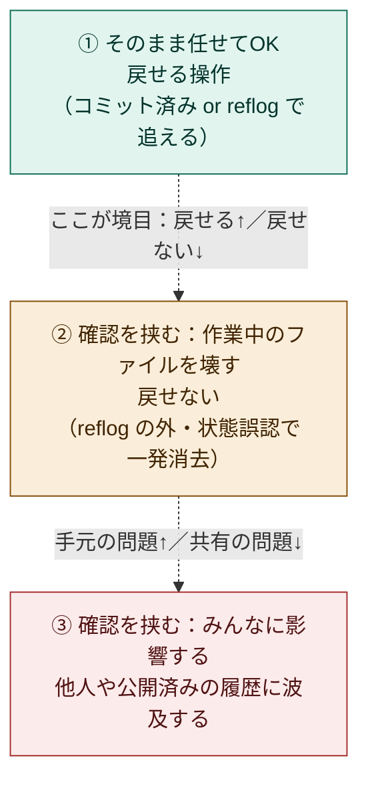
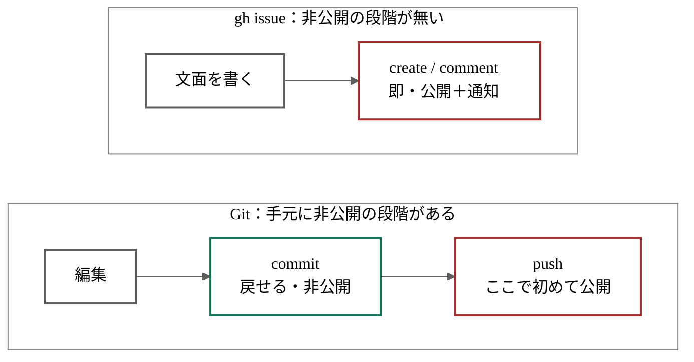

# LLMにGitをどこまで操作させるか — 権限の境界設計

LLM（AIエージェント）にGit操作を任せるとき、「どこまで自由にやらせて、どこから人間が確認するか」を決めておくと安全に運用できる。本ドキュメントでは、その境界を **3つの領域** に分けて整理する。

判断の軸は「ローカルかリモートか」ではなく、**間違えたときに戻せるかどうか（回復可能性）** に置く。この軸で切ると境界がはっきりする。

---

## 1. 3つの領域

| 領域 | ひとことで | 制限の方針 |
|------|-----------|-----------|
| ① そのまま任せてOK | 戻せる操作 | LLMに自由にやらせる |
| ② 作業中のファイルを壊す | 戻せない操作 | 実行前に人間が確認 |
| ③ みんなに影響する | 共有履歴に波及する操作 | 実行前に人間が確認（チーム開発では必須） |

---

## 2. 各領域の性質

### ① そのまま任せてOK（戻せる操作）

**性質：** 何も壊さない「見るだけ」の操作と、変更しても後から元に戻せる操作。間違えてもリカバリできるため、LLMに自由に実行させてよい。

むしろこの領域では、LLMに **こまめにコミットさせる** ほうが安全側に倒れる。コミットは「セーブポイント」を作る操作であり、増やすほど戻れる地点が増えるため。

### ② 確認を挟む：作業中のファイルを壊す（戻せない操作）

**性質：** **まだコミットしていない（＝セーブしていない）編集内容を消す** 操作。コミット済みでないため、履歴をたどる仕組み（`reflog`）でも取り戻せない。

最も注意すべき領域。LLMが「今は変更がない状態だ」と現在の状態を **誤認** したまま実行すると、編集中の内容が一発で消える。リモートかどうかに関係なく、ここに該当する操作は人間の確認を挟むべき。

### ③ 確認を挟む：みんなに影響する（共有履歴に波及する操作）

**性質：** 自分の手元は壊れないが、GitHub などリモート上の **共有された履歴** を書き換える操作。影響範囲（ブラスト半径）が自分以外に及ぶ。

一人で使うリポジトリではリスクは小さいが、チームで共有しているリポジトリでは他の人の作業を壊すおそれがある。チーム開発では最初から確認を必須にする。

---

## 3. 具体的に制限するコマンド

### ① そのまま任せてOK（制限しない）

| コマンド | 何をするか | なぜ安全か |
|---------|-----------|-----------|
| `git status` | 現在の状態を表示 | 見るだけ |
| `git log` | コミット履歴を表示 | 見るだけ |
| `git diff` | 変更箇所を表示 | 見るだけ |
| `git show <コミット>` | コミットの中身を表示 | 見るだけ |
| `git add <ファイル>` | コミット予定に印をつける | `git restore --staged` で外せる |
| `git commit -m "..."` | セーブポイントを作る | 履歴に残るので後で呼び出せる |
| `git stash` | 変更を一時的にしまう | `git stash pop` で戻せる |
| `git branch <名前>` | ブランチを作る | 本流は残る |
| `git switch <名前>` | ブランチを切り替える | 本流は残る |

### ② 確認を挟む：作業中のファイルを壊す

| コマンド | 何をするか | 注意点 |
|---------|-----------|--------|
| `git reset --hard` | 作業中の変更を破棄して巻き戻す | `--hard` が危険。編集中の内容がまるごと消える（`--hard` なしはファイルを消さないので比較的安全） |
| `git clean -fd` | 未管理の新規ファイル/フォルダを削除 | `git clean -n` で「何が消えるか」を事前確認できる |
| `git checkout -- <ファイル>` （新: `git restore <ファイル>`） | ファイルを最後のコミット状態に戻す | 編集中の内容を捨てる |
| `git rebase`（共有前ブランチ以外） | 履歴を組み替える | 状態誤認で混乱しやすい |

### ③ 確認を挟む：みんなに影響する

| コマンド | 何をするか | 注意点 |
|---------|-----------|--------|
| `git push` | コミットをリモートに送る | 通常は追記で比較的安全だが、共有の起点になる |
| `git push --force` / `-f` | リモートの履歴を上書き | 他人の作業を消すおそれ。`--force-with-lease` に置き換えるのが定石 |
| `git push origin --delete <ブランチ>` | リモートのブランチを削除 | 共有ブランチの消失 |
| `git push origin --delete <タグ>` | リモートのタグを削除 | 公開済みタグの消失 |
| `main` など保護ブランチへの直接 push | 本流を直接書き換え | チーム運用では通常禁止 |

---

## 4. `gh issue` の場合（GitHub Issue の操作）

`gh` コマンドで Issue を操作する場合は、git とは **効く軸が変わる**。

git には「ローカルでコミット（非公開）→ push して公開」という手元の段階（buffer）があった。だから「コミットは自由、push がゲート」と言えた。ところが `gh issue create` や `gh issue comment` には、その **手元の非公開ゾーンが無い**。作成した瞬間に共有スペースへ公開され、しかも **自分本人の名前で投稿** され、通知も飛ぶ。git で言えば「いきなり push される」のと同じ。

そのため Issue では、回復可能性に加えて **「人に届いてしまったかどうか」** が主役の軸になる。コメントは後から編集・削除できる（＝状態は戻せる）が、**飛んでしまった通知メールは取り消せない**。

### 各領域の性質（`gh issue`）

- **① 見るだけ：** 読み取りのみ。何も変えないので完全に安全。
- **② 公開される・通知が飛ぶ：** 状態は戻せる（close は reopen でき、コメントも編集・削除できる）が、即公開かつ本人名義で投稿される。git の「②作業ツリー破壊」が *データ* の取り返しのつかなさだったのに対し、こちらは *社会的な* 取り返しのつかなさ。
- **③ 本当に戻せない：** `delete` は完全に消える。Issue には `reflog` のような救済が無い。

### 制限するコマンド（`gh issue`）

| 領域 | コマンド | 何をするか | 注意点 |
|------|---------|-----------|--------|
| ① 任せてOK | `gh issue list` | Issue 一覧を表示 | 見るだけ |
| ① 任せてOK | `gh issue view <番号>` | Issue の詳細を表示 | 見るだけ |
| ① 任せてOK | `gh issue status` | 自分に関係する Issue を表示 | 見るだけ |
| ② 確認を挟む | `gh issue create` | 新規 Issue を作成 | 作成した瞬間に公開＋通知。本人名義 |
| ② 確認を挟む | `gh issue comment <番号>` | コメントを投稿 | 即公開＋通知。本人名義 |
| ② 確認を挟む | `gh issue edit <番号>` | タイトル/本文/ラベル等を変更 | 内容を書き換える |
| ② 確認を挟む | `gh issue close` / `reopen` | Issue を閉じる/再開する | 戻せるが通知が飛ぶ |
| ③ 確認を挟む | `gh issue delete <番号>` | Issue を完全に削除 | 救済が無い。一人運用でもゲート |
| ③ 確認を挟む | `gh issue transfer` | 別リポジトリへ移動 | 破壊的 |
| ③ 確認を挟む | `gh issue lock` | コメントを封じる | 他人の発言を止める |

### 実用のコツ：buffer を人間が肩代わりする

git に自然にあった「非公開の置き場」を、人間の確認で肩代わりするのが効く。`gh issue create` を直接叩かせるのではなく、LLM には **本文を「下書き」としてチャットやファイルに出させ、確認してから投稿** する。これで「いきなり公開」のリスクをほぼ潰せる。

Hiroaki のリポジトリ（iron bead の記録、tech-learning-log、FrameWeaver など）はほぼ一人運用なので、② は `create` / `comment` / `close` まで任せても実害は小さい。**③（特に `delete` と `transfer`）だけ必ず確認** で十分。将来コントリビューターを受け入れる公開リポジトリになったら、② も「下書き→承認」に引き上げる二段構えがきれい。

---

## 5. まとめ

- 境界の軸は **回復可能性**。「戻せる操作」と「戻せない操作」で線を引くと判断がぶれない。
- **① 戻せる操作** は自由に任せ、むしろ **こまめにコミットさせる**。セーブポイントが増えるほど安全になる。
- **② 作業中のファイルを壊す操作** が実は最重要。`reflog` でも戻せず、状態誤認で一発消去されるため、**ここに確認を挟むのを最優先** にする。
- **③ 共有履歴に波及する操作** は、一人運用ならリスク小。チーム開発のリポジトリを触るときだけ厳しくする **二段構え** が現実的。
- **`gh issue` は軸が変わる**。手元の非公開段階が無く、作成＝即公開＋本人名義の通知。`create` / `comment` は **下書き→人間が承認→投稿** にすると安全。`delete` / `transfer` は最初からゲート。
- 許可リストだけに頼らず、リモート側の **ブランチ保護**（`main` への直 push 禁止、force-push 禁止）も別レイヤーで張っておくと、設定がどうであれ最後の砦になる。「LLMに何をタイプさせるか」と「その認証情報がどこまで触れるか」は分けて考える。

> Claude Code などのツールでは、この区分けをそのまま「許可するコマンド／確認を求めるコマンド」の設定に落とし込める。
