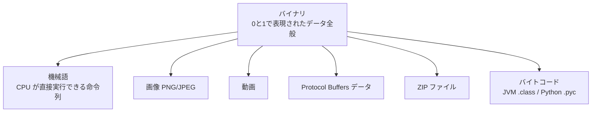
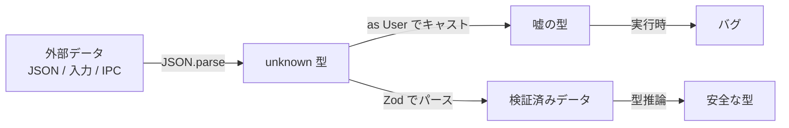
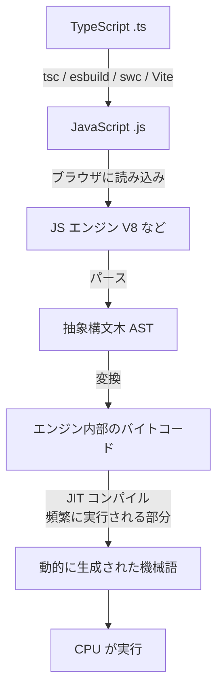

# コンパイル時と実行時

## ドキュメント概要

このドキュメントでは、プログラムのライフサイクルにおける「コンパイル時」と「実行時」の違い、および関連する概念 (機械語、バイナリ、トランスパイル) を整理します。具体的には以下の内容を扱います。

- コンパイル時と実行時の定義とエラーの違い
- 言語ごとの実行モデルの違い (コンパイル型、インタプリタ型、JIT)
- 機械語とバイナリの違い
- TypeScript の型情報が「消える」とはどういうことか
- 言語別の型のライフサイクル比較
- トランスパイルとコンパイルの違い

型がいつ・どこに存在するかを理解するために、**コンパイル時**と**実行時**の違い、および機械語・バイナリ・トランスパイルといった関連概念を整理します。

## プログラムのライフサイクル

プログラムには大きく 2 つのフェーズがあります。


| フェーズ | 何が起きるか | 例 |
|---|---|---|
| コンパイル時 (compile time) | ソースコードを変換する | 型チェック、構文チェック、最適化 |
| 実行時 (runtime) | 変換されたものが動いている | 計算、入出力、メモリ確保 |

「ユーザーが操作している間」「サーバーがリクエストを処理している間」、すべて実行時です。

## エラーが起きるタイミング

| タイミング | エラーの例 |
|---|---|
| コンパイル時 | 「型が合いません」「セミコロンが足りません」「未定義の変数です」 |
| 実行時 | 「ファイルが見つかりません」「ネットワークエラー」「null を参照しました」 |

## 実行時 = 機械語が動いている時 ?

**コンパイル型言語では概ね正しい**ですが、すべての言語に当てはまるわけではありません。

### コンパイル型言語 (Rust, C, C++, Go など)


ここでは「実行時 = 機械語が動いている時」で正しいです。

### インタプリタ型言語 (Python, Ruby など)


機械語に変換されるというより、**インタプリタというプログラムがソースコードを読みながら動く**。

### JIT コンパイル言語 (JavaScript, Java など)


実行時の中でさらにコンパイルが起きる。コンパイル時と実行時の境界が動的です。

### TypeScript の場合


TypeScript の「コンパイル」は JavaScript への **トランスパイル** で、機械語までは行きません。型チェックはこの `tsc` の段階で行われ、ここで型情報が消えます。

## 機械語とバイナリの違い

「機械語 = バイナリ」と思われがちですが、厳密には別の概念です。



| 用語 | 意味 |
|---|---|
| バイナリ | 0 と 1 で表現されたデータ全般 (テキストでないもの) |
| 機械語 | CPU が直接実行できる命令列 (バイナリの一種) |
| 実行ファイル | 機械語 + メタデータをまとめたファイル (`.exe`, ELF など) |
| バイトコード | 仮想マシン用の中間表現 (バイナリの一種) |

たとえば x86_64 で「レジスタ EAX に値 5 を入れる」という機械語命令は、`B8 05 00 00 00` のようなバイト列になります。これがバイナリの一形態としての機械語。

つまり **バイナリ ⊃ 機械語** の関係です。

## TypeScript の「型情報が消える」とは

### 重要な事実: TypeScript は機械語にコンパイルされない

TypeScript は **JavaScript にトランスパイルされる** だけで、機械語までは行きません。JavaScript はテキストファイルで、バイナリではありません。

### 実際の変換例

このコードを `tsc` でコンパイルすると、

```typescript
interface User {
  id: number;
  name: string;
}

function greet(user: User): string {
  return `Hello, ${user.name}`;
}

const u: User = { id: 1, name: "Alice" };
console.log(greet(u));
```

こうなります。

```javascript
function greet(user) {
  return `Hello, ${user.name}`;
}

const u = { id: 1, name: "Alice" };
console.log(greet(u));
```

**型注釈がすべて消えています**。`interface User`, `: User`, `: string`、すべて消失。JavaScript は型を持たない言語なので、TypeScript の型情報を保存する場所がありません。

### 結果: 実行時には型がない

JavaScript エンジンが見ているのは型情報のない JavaScript だけです。

```javascript
function greet(user) {
  return `Hello, ${user.name}`;
}

greet("文字列です");  // 実行時エラーにならない、"Hello, undefined" が返る
greet(42);           // 同上
```

TypeScript の段階では `greet("文字列")` はコンパイルエラーになります。しかしコンパイル後の JavaScript には型情報が無いので、実行時には何でも受け取れてしまう。これが **「型情報が実行時に残らない」** の意味です。

## Rust ではどうか

Rust もコンパイル後の機械語には型情報は基本的に残りません。`u32` も `i32` も、機械語レベルでは「4 バイトのデータ」でしかない。

ただし Rust は:

- コンパイル時の型チェックが厳密で、**型エラーがあるとそもそも実行ファイルが作られない**
- 機械語に変換される際、型に基づいた最適化が行われる

なので、「型情報自体は消えるが、型による保証はコンパイル時に使い切られているので、実行時には型違反が起きえない」という構造です。

## 言語別の型のライフサイクル比較

| 言語 | コンパイル後の形式 | 実行時の型チェック | 型違反のリスク |
|---|---|---|---|
| TypeScript | JavaScript (テキスト) | なし | あり (境界で破れる) |
| Rust | 機械語 (バイナリ) | コンパイル時に保証済み | なし |
| Python | バイトコード (バイナリ .pyc) | あり (動的型付け) | 実行時に検出 |
| Java | バイトコード (JVM 解釈) | あり (実行時に型を持つ) | 実行時に検出 |
| C / C++ | 機械語 (バイナリ) | なし (静的のみ) | あり (未定義動作) |

## TypeScript の型が消える問題と Zod の出番



外部から `JSON.parse` で来たデータに `as User` と書いても、**実行時には誰もチェックしてくれない**。型がコンパイル時の情報だから、こうなります。

これを補うのが Zod のような実行時バリデーションライブラリです。

→ Zod の詳細については `type_systems_overview.md` を参照。

## トランスパイルとコンパイルの違い

しばしば混同される 2 つの用語を整理します。

| 用語 | 意味 |
|---|---|
| コンパイル (compile) | ソースコードを別の形式に変換する処理全般 |
| トランスパイル (transpile) | source-to-source compilation。**同じ抽象レベルの別言語**に変換 |

TypeScript → JavaScript はトランスパイルです。両方とも人間が読める高級言語で、抽象レベルが近い。一方、Rust → 機械語は普通の意味のコンパイル。抽象レベルがガクッと下がります。

ただ、TypeScript の公式ドキュメントでは `tsc` を「TypeScript Compiler」と呼んでいるので、**トランスパイルもコンパイルの一種**と捉えるのが現代的です。

### 他のトランスパイル例

| 変換 | 用途 |
|---|---|
| JSX/TSX → JavaScript | React の構文を関数呼び出しに変換 |
| Sass/SCSS → CSS | より便利な記法を CSS に戻す |
| Babel: 新しい JS → 古い JS | 古いブラウザ向けにダウングレード |
| Kotlin → JavaScript | Kotlin のマルチターゲット出力 |

## TypeScript の実行までの完全な流れ



最終的には機械語になって動きますが、それは **JavaScript エンジンの内部の話** で、TypeScript 開発者からは見えません。「TypeScript は機械語にトランスパイルされない」というのは、`tsc` の責任範囲の話、と理解するのが正確です。

## まとめ

- **コンパイル時** = ソースコードを変換している時間 (型チェックもここで起きる)
- **実行時** = プログラムが動いている時間 (型情報は基本的に消えている)
- **機械語** はバイナリの一種で、CPU が直接実行できる命令列
- **TypeScript** は機械語ではなく **JavaScript にトランスパイル**される
- 型情報が実行時に消えるため、**外部境界では Zod などのランタイム検証が必要**

→ なぜ型情報が機械語に不要なのかは `purpose_of_types.md` を参照。
→ コンパイル時の検査の役割については `compile_vs_build.md` を参照。
