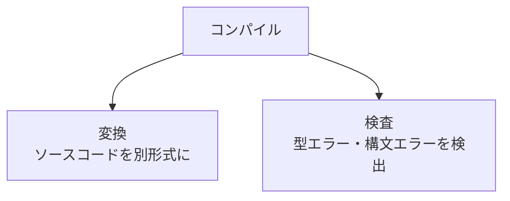
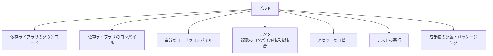
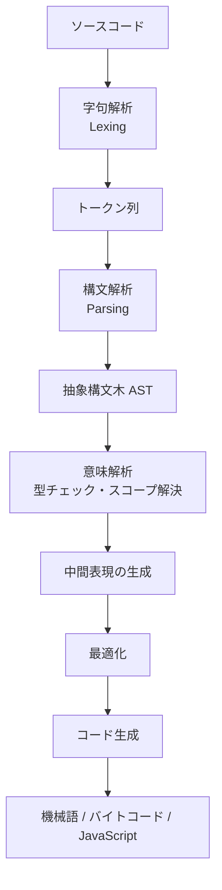
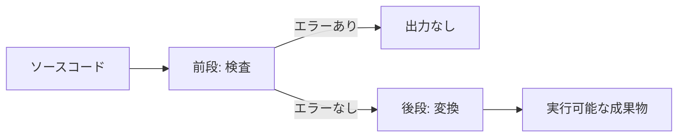
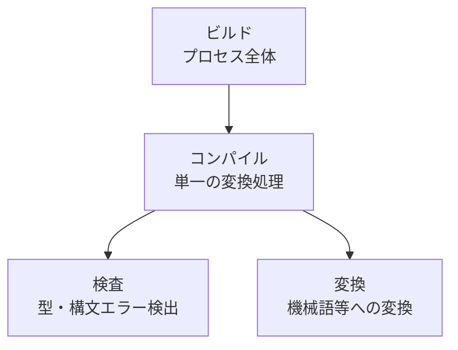

# コンパイルとビルドの違い

## ドキュメント概要

このドキュメントでは、しばしば混同される「コンパイル」と「ビルド」という用語の責任範囲を整理します。具体的には以下の内容を扱います。

- コンパイルの 2 つの役割 (変換と検査)
- コンパイルとビルドの違い (ビルド ⊃ コンパイル)
- コンパイラの内部フェーズ (字句解析、構文解析、意味解析、コード生成)
- 検査と変換が同じツールで行われる理由
- 主要なビルドツールの例
- 「ビルドエラー」と「コンパイルエラー」の使い分け

「コンパイル」と「ビルド」はしばしば混同される用語です。それぞれの責任範囲を整理します。

## コンパイルの 2 つの役割

コンパイルには大きく 2 つの役割があります。

| 役割 | 説明 |
|---|---|
| 変換 | 人間が読めるソースコードを、別の形式 (機械語、JavaScript、バイトコード等) に変換する |
| 検査 | 型エラー、構文エラー、未使用変数などを検出して人間に伝える |

**この 2 つは同じコンパイラの中で同時に行われています**。

## コンパイルとビルドの違い

### コンパイル (compile)

ソースコードを別の形式に変換する **単一の処理** を指します。

| コマンド | 役割 |
|---|---|
| `rustc main.rs` | `main.rs` を機械語に変換 |
| `tsc app.ts` | `app.ts` を JavaScript に変換 |
| `javac Main.java` | `Main.java` を JVM バイトコードに変換 |

この過程で型チェックや構文チェックが行われ、エラーがあれば人間に報告されます。

### ビルド (build)

**ソフトウェアを実行可能な形にするための一連の作業全体** を指します。コンパイルはその一部に過ぎません。

例えば、Rust プロジェクトのビルドではこういうことが起きます:

1. 依存クレートのダウンロード (cargo が crates.io から取得)
2. 依存クレートのコンパイル
3. 自分のコードのコンパイル
4. リンク (複数のコンパイル結果を 1 つの実行ファイルにまとめる)
5. アセットのコピー
6. テストの実行 (必要なら)
7. 成果物の配置

このプロセス全体がビルドです。

## 用語の整理

| 用語 | 意味 | 例 |
|---|---|---|
| コンパイル | ソースコードを別形式に変換する単一の処理 (検査も同時に行う) | `rustc`, `tsc`, `javac` |
| トランスパイル | 同じ抽象レベルの別言語に変換するコンパイル | TypeScript → JavaScript |
| リンク | コンパイル済みの複数のオブジェクトを繋いで実行ファイルにする | `ld`, リンカ |
| ビルド | ソフトウェアを完成形にするプロセス全体 | `cargo build`, `pnpm build` |

**ビルド ⊃ コンパイル** の関係です。

## コンパイラの内部フェーズ

「変換」と「検査」と一言で言いましたが、実際にはコンパイラはもっと細かいフェーズに分かれています。

| フェーズ | 役割 |
|---|---|
| 字句解析 (Lexing) | ソースコードをトークンに分解 |
| 構文解析 (Parsing) | トークン列を AST (抽象構文木) に変換 |
| 意味解析 | 型チェック、スコープ解決、**人間の間違いを検出** |
| 中間表現生成 | 内部表現 (IR) に変換 |
| 最適化 | より効率的なコードに変形 |
| コード生成 | 最終的な出力 (機械語など) を生成 |

### 検査と変換の関係

- **検査が先に行われる** (前段)
- **変換は後で行われる** (後段)
- **前段で問題があれば後段に進まない** (実行ファイルが生成されない)

これが「型エラーがあるとそもそも実行ファイルが作られない」という挙動の正体です。コンパイラは「人間の意図を機械の言葉に翻訳する翻訳者」であると同時に、「翻訳前に意味の通らない文章を弾く編集者」でもあります。

## なぜ「検査」と「変換」を同じツールでやるのか

これは設計上の選択で、別々にすることもできます。

### 分割するパターン

| 役割 | ツール例 |
|---|---|
| Linter (構文・スタイル検査) | ESLint |
| 型チェッカー | (独立した型チェック専用ツール) |
| トランスパイラ (変換) | Babel |

JavaScript の生態系では Babel (変換) と ESLint (検査) が別ツールになっていたりします。

### 統合するパターン

多くの言語では、**型チェックと変換は密接に絡む** (型情報を使って最適な機械語を選ぶ、など) ので、同じツールで一気にやるのが効率的です。

| 言語 | 統合ツール |
|---|---|
| Rust | rustc |
| TypeScript | tsc |
| Go | go build |
| Java | javac |

## ビルドツールの例

実際のプロジェクトでは、コンパイラの上にビルドツールが乗ることが多いです。

| ツール | 言語/エコシステム | 役割 |
|---|---|---|
| cargo | Rust | 依存管理 + ビルド + テスト |
| npm / pnpm scripts | Node.js | タスクランナー |
| Vite / esbuild / webpack | フロントエンド | バンドル + トランスパイル |
| Maven / Gradle | Java | 依存管理 + ビルド |
| Make / CMake | C/C++ | 一般的なビルドツール |

これらは内部でコンパイラを呼び出しつつ、依存解決・リンク・パッケージングなどを管理します。

## 「ビルドエラー」と「コンパイルエラー」

日常会話では「ビルドが通らない」「ビルドエラー」と言うことがよくあります。これは厳密には「ビルドの過程の一部であるコンパイルでエラーが出た」という意味で、慣用的にビルドという言葉が使われています。

文脈で通じるので神経質に区別する必要はありませんが、ツールの責任範囲を理解する上では区別すると整理しやすいです。

| 表現 | 厳密な意味 |
|---|---|
| 「コンパイルエラー」 | コンパイラが検査の段階で検出したエラー |
| 「ビルドエラー」 | ビルドプロセス全体のどこかで起きたエラー (コンパイルエラーも含む) |
| 「型エラー」 | 意味解析フェーズでの型不一致 (コンパイルエラーの一種) |
| 「構文エラー」 | 字句解析・構文解析フェーズでのエラー (コンパイルエラーの一種) |

## まとめ

- **コンパイル**: 単一の変換処理 (検査も同時に行う)
- **ビルド**: コンパイルを含む、ソフトウェア完成までの全プロセス
- コンパイラの中では **検査が先、変換が後**
- 検査でエラーがあれば、変換まで進まない (これが型の安全性の源)

→ 型情報がコンパイル時に使われ、機械語に残らない仕組みは `purpose_of_types.md` を参照。
→ コンパイル時と実行時の違いは `compile_time_and_runtime.md` を参照。
