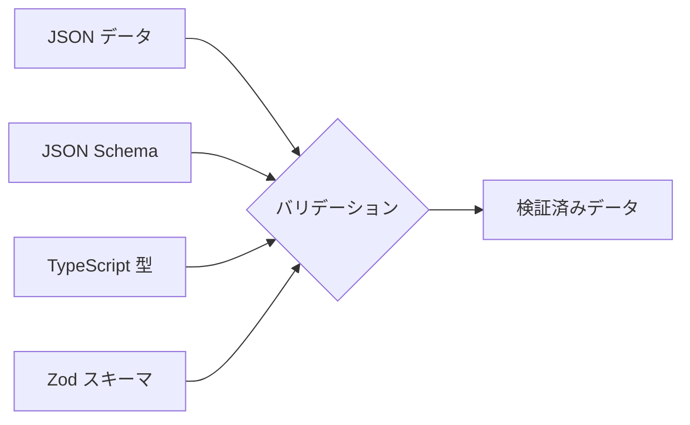
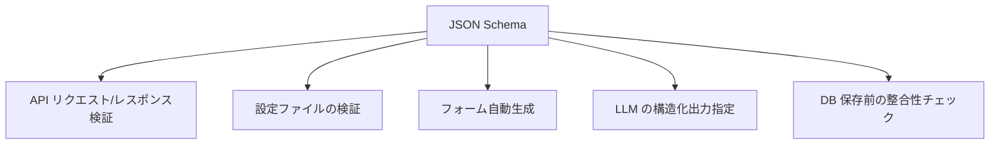

# JSON と JSON Schema

## ドキュメント概要

このドキュメントでは、JSON における「型」の扱いと、JSON の構造を記述するための仕様である JSON Schema について整理します。具体的には以下の内容を扱います。

- JSON が持つ 6 種類の値の型 (string, number, boolean, null, object, array)
- 「JSON に型がない」という言い方が実際に指している意味
- JSON Schema の基本概念、文法、表現できる制約の種類
- JSON Schema の主な用途 (API 検証、設定ファイル、フォーム生成など)
- TypeScript の型との違い

## JSON に「型」はあるか?

JSON 自体には、仕様 (RFC 8259) で定められた **6 種類の値の型** が存在します。

| 型 | 説明 | 例 |
|---|---|---|
| string | 文字列 | `"hello"` |
| number | 数値 | `42`, `3.14` |
| boolean | 真偽値 | `true`, `false` |
| null | null 値 | `null` |
| object | キーと値のペア | `{"name": "Alice"}` |
| array | 配列 | `[1, 2, 3]` |

つまり厳密には「JSON に型がない」のではなく、**この 6 種類しかなく、表現力が乏しい**というのが正確な表現です。

## 「型がない」と言われる本当の意味

実務で「JSON に型がない」と言われるとき、意図されているのは主に次の点です。

### スキーマ (構造の型定義) がない

例えば TypeScript のような「このオブジェクトはこういう形をしているはず」という制約は JSON 自体には存在しません。

```json
{"id": "abc", "name": 123}
```

これは「id は数値、name は文字列であるべき」というルールに反していても、**JSON としては完全に正しい**のです。

### 数値型の細かい区別がない

`number` しかなく、整数 / 浮動小数点、int32 / int64、Decimal の区別はありません。`1` と `1.0` を区別しない実装も多いです。

### 日付や日時の型がない

ISO 8601 形式の文字列で表現するのが慣習ですが、JSON 仕様としてはただの `string` です。

### バイナリ型がない

Base64 エンコードした文字列で表現するしかありません。

## これらを補う仕組み

JSON の表現力の弱さを補うために、外側からスキーマや型を与える仕組みが使われます。



代表的なものとして、**JSON Schema**, **TypeScript の型**, **Zod**, **Protocol Buffers** などが挙げられます。

→ 詳細は `type_systems_overview.md` を参照。

---

## JSON Schema とは

**JSON がどんな構造であるべきかを記述するための仕様**です。JSON 自体で書かれた、JSON のバリデーションルールと言えます。

### 基本例

検証したいデータ:

```json
{
  "id": 1,
  "name": "Alice",
  "email": "alice@example.com"
}
```

対応する JSON Schema:

```json
{
  "$schema": "https://json-schema.org/draft/2020-12/schema",
  "type": "object",
  "properties": {
    "id": { "type": "integer" },
    "name": { "type": "string", "minLength": 1 },
    "email": { "type": "string", "format": "email" }
  },
  "required": ["id", "name", "email"],
  "additionalProperties": false
}
```

このスキーマを使うと、次のようなデータの問題を検出できます。

- `{"id": "abc"}` → id が整数でない
- `{"id": 1, "name": ""}` → name が空文字列
- `{"id": 1, "name": "Alice"}` → email が必須なのに欠けている

## JSON Schema で表現できること

| 種類 | キーワード | 説明 |
|---|---|---|
| 型チェック | `type` | `string`, `integer`, `object`, `array` など |
| 値の範囲 | `minimum`, `maximum` | 数値の最小/最大 |
| 文字列長 | `minLength`, `maxLength` | 文字列の長さ制約 |
| 文字列パターン | `pattern` | 正規表現 |
| 列挙 | `enum` | 許可される値のリスト |
| 必須項目 | `required` | 必須プロパティ |
| 追加プロパティ | `additionalProperties` | 未定義プロパティを許すか |
| フォーマット | `format` | `email`, `date-time`, `uri`, `uuid` など |
| 合成 | `oneOf`, `anyOf`, `allOf` | ユニオン型・交差型のような表現 |
| 参照 | `$ref` | 別スキーマや自分自身を参照 (再帰構造) |

## 主な用途



具体例として、

- **API 検証**: OpenAPI (Swagger) は内部的に JSON Schema のサブセットを使用
- **設定ファイル**: VS Code の `settings.json` や `tsconfig.json` のスキーマがエディタ補完を実現
- **フォーム生成**: `react-jsonschema-form` などがスキーマから入力フォームを自動生成
- **LLM 出力**: OpenAI や Anthropic の API で構造化出力を指定する際に使用

## TypeScript の型との違い

| 観点 | TypeScript の型 | JSON Schema |
|---|---|---|
| いつチェックされるか | コンパイル時 | 実行時 |
| 何ができるか | 型互換性のチェック | 値の制約も含めた検証 |
| 外部データへの保証 | なし (キャストは嘘の可能性) | あり |
| 言語依存 | TypeScript 専用 | 言語非依存 (JSON で記述) |

両方を繋ぐために、**スキーマから型を生成する** (json-schema-to-typescript)、または **型からスキーマを生成する** (TypeBox) ツールがよく使われます。

→ 「コンパイル時」と「実行時」の違いについては `compile_time_and_runtime.md` を参照。

## 公式情報

- 公式サイト: [json-schema.org](https://json-schema.org/)
- 現行ドラフト: Draft 2020-12 (実質的に安定して使われている)
