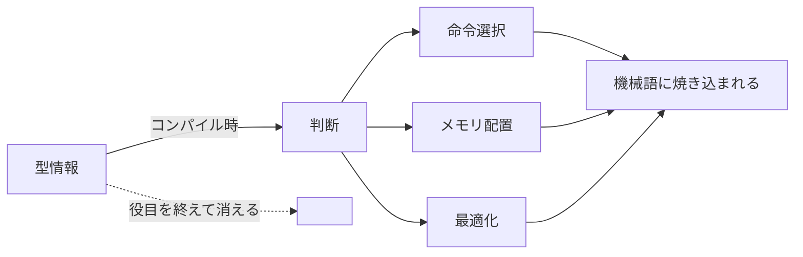
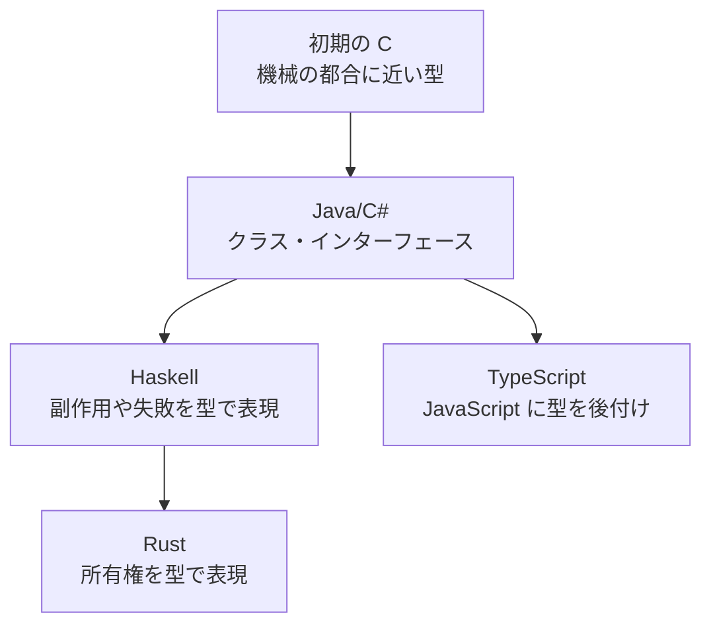

# 型は誰のためのものか

## ドキュメント概要

このドキュメントでは、「型は何のために存在するのか」という根本的な問いを掘り下げます。具体的には以下の内容を扱います。

- なぜ機械語に型情報が不要なのか (CPU は型を知らない)
- コンパイラが型情報をどう使って機械語を生成するか
- 型の人間側の役割 (ドキュメント、ミス検出、リファクタリング、補完)
- 型の機械側の役割 (最適化、メモリ安全性、並行処理の正しさ)
- 型システムの歴史的な変遷と言語ごとの比重の違い

「型はコンパイル時の情報で、実行時に消える」という事実から、次のような問いが生まれます。

> **型って人間がソフトウェア開発をするためのものなのでは?**

結論から言うと、**概ね正しい**です。ただし、それと密接に関わる **機械のための型** という側面もあります。

## なぜ機械語に型情報が不要なのか

CPU は **「型」という抽象を知りません**。CPU が扱うのは:

- メモリ上のバイト列 (アドレスとそこにある 0/1 のパターン)
- レジスタ (CPU 内部の小さな高速記憶)
- 命令 (このバイト列をあそこに移せ、足せ、比較しろ、など)

これだけです。「これは User 型のオブジェクトです」「これは整数です」という情報は持ちません。

### 整数と浮動小数点の区別

CPU は型を知らないのに、整数の加算と浮動小数点の加算は別物として扱う必要があります。

**答え: 命令そのものが分かれている**

- `ADD eax, ebx` ← 整数の加算命令
- `ADDSS xmm0, xmm1` ← 単精度浮動小数点の加算命令

同じ「足す」でも、命令コードが違います。CPU はバイト列を見て「これは整数加算命令だ」と判断して動作するだけ。**型情報は命令の選び方に焼き込まれている**わけです。

### コンパイラの仕事

```rust
let a: i32 = 5;
let b: i32 = 3;
let c = a + b;
```

```rust
let a: f64 = 5.0;
let b: f64 = 3.0;
let c = a + b;
```

ソースコード上は同じ `+` ですが、コンパイラは型情報を見て、

- 前者には整数加算命令 (`ADD`)
- 後者には浮動小数点加算命令 (`ADDSD`)

を生成します。**型は「どの機械語命令を選ぶか」を決めるための情報** として使われ、機械語が生成されたら役目を終える。だから機械語に型情報を残す必要がない。

### メモリレイアウトでも同様

`struct User { id: u32, name: String }` のような型があったとき、コンパイラはこう判断します:

- `id` は 4 バイト
- `String` はポインタ + 長さ + 容量で 24 バイト (64bit 環境)
- だから `User` は 28 バイト、こういう順番でメモリに配置する

機械語レベルでは「`user.id` にアクセスする」は「ベースアドレスから 0 バイト目を 4 バイト読む」になります。**型情報がアドレス計算に変換されて消える**。



> **型は「コンパイラが正しい機械語を生成するために使う情報」であって、生成された機械語には不要**。

これがコンパイル型言語で型情報が消える本質的な理由です。

## 型の主な役割 (人間側の視点)

ここからは、開発者にとっての型の意義を見ていきます。

### 1. 人間のためのドキュメント

```typescript
function calculatePrice(item: Product, quantity: number, discount?: Discount): Money
```

このシグネチャを見ただけで、「Product と数量を渡すと Money が返る、割引はオプション」と分かります。**コードを読む人間** (未来の自分、同僚、OSS の利用者) のための情報です。

### 2. 人間のミスを早期に検出

```typescript
const user = getUser();
console.log(user.nmae);  // typo
```

実行する前にエディタが赤線を引いてくれる。**実行時にバグるより前に人間に気づかせる仕組み** です。

### 3. リファクタリングを安全にする

`User` 型から `email` フィールドを削除したら、`user.email` を使っている全箇所がエラーになります。**変更の影響範囲を機械的に追える**。型がないと、grep と目視で確認するしかありません。

### 4. エディタの補完を効かせる

`.` を打つと候補が出る。これも結局、人間がコードを書きやすくするためです。

## 機械のための型もある

「人間のためだけ」と言い切ると、少しだけ取りこぼします。

### 性能の最適化

Rust で `Vec<i32>` と書いたとき、コンパイラは「要素は 4 バイト、メモリは連続配置、ポインタ経由のディスパッチは不要」と判断して、高速な機械語を生成できます。

一方 JavaScript の配列は何でも入るので、エンジンは実行時に「これは整数だけの配列か?」を推測しながら動かす必要があり、最適化の余地が小さい。

つまり、**型情報があるとコンパイラがより良い機械語を生成できる**。

### メモリ安全性

Rust の所有権システムは型システムの上に乗っています。「この値はムーブされたから、もう使えない」というのを型で表現する。これがコンパイル時にチェックされることで、**実行時のメモリ安全性が保証される**。

### 並行処理の正しさ

Rust の `Send` / `Sync` トレイトは、「この型はスレッド間で共有しても安全か」を型レベルで表現します。これも機械が判断するための情報。

## より正確な言い方

> **型は、人間が安全に・効率的にソフトウェアを開発するための仕組み。同時に、機械がより安全で高速なコードを生成するための情報源にもなる。**

ただし、優先順位としては **人間のため** が大きいです。

| 観点 | 説明 |
|---|---|
| 型がなくてもプログラムは動くか | 動く (JavaScript、Python の例がある) |
| 型がなくて困るのは何か | 人間が大規模なコードベースを把握しきれなくなる |
| 機械にとって必須か | 必須ではない (型なし言語でも実行可能) |

## 歴史的視点: 型システムは人間のためにどんどん複雑化してきた



| 言語 | 型システムの傾向 |
|---|---|
| 初期の C | 単純な型 (int, char, ポインタ)。主にメモリレイアウトを反映 |
| Java / C# | クラス・インターフェースでドメインを表現 |
| Haskell | 副作用や失敗を型で表現 |
| Rust | 所有権、借用、ライフタイムを型で表現 |
| TypeScript | JavaScript に型を後付けする極端な例 |

特に TypeScript は分かりやすい例です。実行時には完全に消える。**機械にとっては何の意味もない**。それでもこれだけ広まっているのは、人間が JavaScript を書く上で型があった方が圧倒的に楽だから。

## まとめ

### 第一義的には人間のため

- 読みやすさ
- 安全性
- 補完
- リファクタリング

### 副次的に機械のためにもなる

- 最適化
- メモリ安全性
- 並行処理の正しさ

### 言語によって比重が違う

| 言語 | 型の比重 |
|---|---|
| TypeScript | ほぼ 100% 人間のため (実行時に消える) |
| Rust | 人間と機械の両方のため (最適化、メモリ安全性) |
| C | 機械の都合に近い (メモリレイアウト中心) |

この視点を持っていると、「なぜ型を書くのか」「なぜスキーマが必要なのか」という問いに、表面的な答え (「バグが減るから」) より一段深い答え (「人間の認知能力が有限だから、機械に補助させるため」) で答えられるようになります。

→ コンパイラがどんな処理をしているかは `compile_vs_build.md` を参照。
