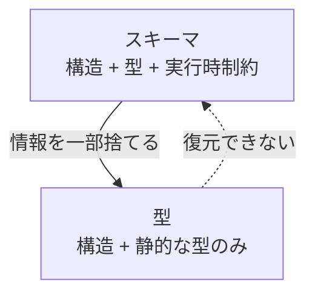

# スキーマと型の関係

## ドキュメント概要

このドキュメントでは、しばしば混同される「スキーマ」と「型」という用語の関係を整理します。具体的には以下の内容を扱います。

- スキーマの基本的な定義
- 「型そのもの」をスキーマと呼ぶ文脈と、呼ばない文脈の違い
- 「スキーマの名前 = 型」という直感的な認識が正確でない理由
- スキーマと型はそれぞれ別レイヤーの概念であることの整理
- 実用的な感覚としての使い分け

「スキーマ」と「型」はしばしば混同される用語です。文脈によって意味が変わるので、整理しておきます。

## スキーマの基本的な定義

**フィールド名とその型を集めた、データの構造定義**を一般にスキーマと呼びます。

```typescript
// これはスキーマの例
{
  id: number,
  name: string,
  email: string
}
```

「データがどんな形をしているか」を記述したもの、というのがスキーマの中核的な意味です。

## 「型そのもの」はスキーマか?

これは **文脈によって変わります**。

### 文脈 A: 「型 ⊂ スキーマ」と捉える

Zod や JSON Schema のような **スキーマ駆動のライブラリ** では、プリミティブな型もスキーマとして扱われます。

```typescript
const NameSchema = z.string().min(1);  // 単一の値の制約もスキーマ
const AgeSchema = z.number().int();    // これもスキーマ
```

Zod では `z.string()` の戻り値は `ZodString` で、これは `ZodSchema` の一種。ライブラリの設計上、**「単一の値に対する制約」も「複数フィールドを持つオブジェクト」もすべて等しくスキーマ**として扱われます。合成可能性のため、こうしている。

JSON Schema も同じです。`{ "type": "string" }` だけで完全な JSON Schema として有効です。

### 文脈 B: 「型 ≠ スキーマ」と区別する

データベースや API 設計の文脈では、**スキーマ = 構造全体**を指し、個々のカラム/フィールドの型はスキーマの構成要素、と区別する語り方をします。

- 「ユーザーテーブルのスキーマ」と言ったとき、それは複数カラムの集合
- 「id カラムの型は INTEGER」と言ったとき、これを「スキーマ」とは言わない

## 文脈別のまとめ

| 文脈 | スキーマの意味 |
|---|---|
| データベース、ER 設計 | テーブル全体、DB 全体の構造。型単体はスキーマと呼ばない |
| JSON Schema、Zod など | 任意の値に対する構造・制約の記述。プリミティブも含めてスキーマ |
| Protocol Buffers | `.proto` ファイル全体、または個々の `message` 定義 |
| GraphQL | 型システム全体 (Query、Mutation、各 type 定義の総体) |

## 「スキーマの名前 = 型」という認識は正しいか?

直感的にはこう思いたくなります。

```typescript
const UserSchema = z.object({  // ← スキーマ
  id: z.number(),
  name: z.string(),
});

type User = z.infer<typeof UserSchema>;  // ← 型
```

ここを見ると、「スキーマに名前を付けたものが型」と言いたくなります。しかし **この認識は正確ではありません**。

### 理由 1: スキーマと型は別レイヤーの概念

| | 型 | スキーマ |
|---|---|---|
| 存在するレイヤー | プログラミング言語の型システム | データに関する記述 |
| いつ存在するか | コンパイル時のみ (TypeScript の場合) | 実行時にメモリ上のオブジェクトとして存在 |
| 誰が解釈するか | コンパイラ/型チェッカー | バリデーションライブラリ |

`UserSchema` は実行時にメモリ上に存在する JavaScript のオブジェクト (Zod のインスタンス) です。一方 `User` 型はコンパイル時にしか存在しません。**実体のレイヤーが違う** ものを「名前付けの関係」とまとめてしまうと本質を見失います。

### 理由 2: 名前のないスキーマもある

```typescript
z.object({ id: z.number() }).parse(data);  // 無名のスキーマ
```

これも立派にスキーマとして機能します。「名前があるかどうか」はスキーマの本質ではありません。

逆に名前のない型もあります (TypeScript の構造的型は名前に依存しない)。

```typescript
const user: { id: number; name: string } = ...;  // 名前のない型
```

### 理由 3: 一つのスキーマから複数の型が導かれる

```typescript
const UserSchema = z.object({
  id: z.number(),
  name: z.string(),
  email: z.string().optional(),
});

type User = z.infer<typeof UserSchema>;       // パース後の型
type UserInput = z.input<typeof UserSchema>;  // パース前の型 (transform があると違う)
```

スキーマと型は一対一とは限りません。

### 理由 4: 型からスキーマが導けるとは限らない

`type User = { id: number }` という型があっても、そこから「id は正の整数である」のような **制約** は復元できません。スキーマは型より情報量が多い。

```typescript
const NameSchema = z.string().min(1).max(50).regex(/^[a-zA-Z]+$/);
type Name = z.infer<typeof NameSchema>;  // ただの string になる
```

型に落とすと制約情報は消えます。



つまり **スキーマ ⊋ 型** の関係です。

## より正確な整理

> **スキーマは、型 + 実行時の制約 + 構造情報を一つにまとめた、データに関する記述。型はそのうち、コンパイル時の構造部分だけを抜き出したもの。**

または、

> **スキーマと型は別レイヤーの概念で、しばしば対応関係を持つが、同一ではない。**

## 実用的な感覚

日常会話では「User スキーマ」「User 型」をなんとなく同じものを指して使うのはアリです。実際そう使われます。ただし以下の区別は頭の中で持っておくと、混乱を避けられます。

| 用語 | 実用的な感覚 |
|---|---|
| スキーマ | 実行時のバリデーション可能なオブジェクト (実体がある) |
| 型 | コンパイル時の構造記述 (実体は消える) |

特に「なぜ型だけじゃダメで、スキーマが必要なのか」という問いに自分で答えられるようになれば、設計判断の質が上がります。

→ 「コンパイル時」と「実行時」の違いについては `compile_time_and_runtime.md` を参照。
