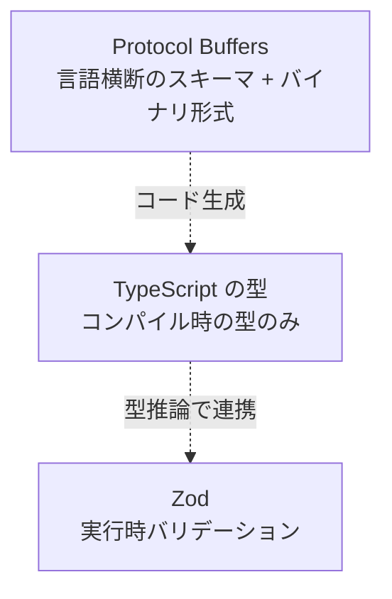
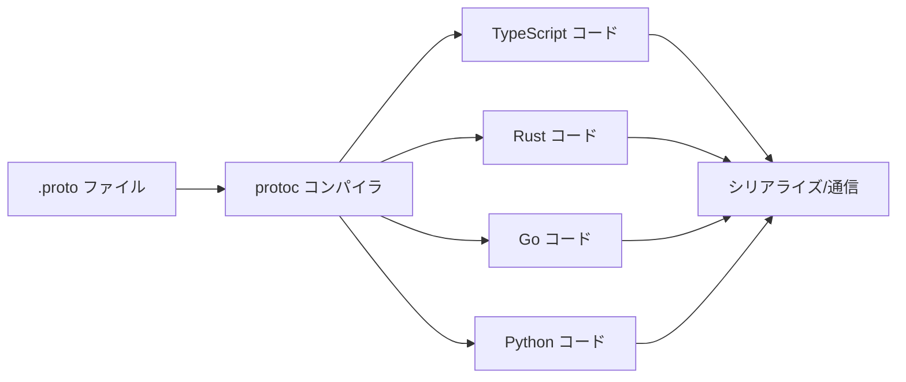
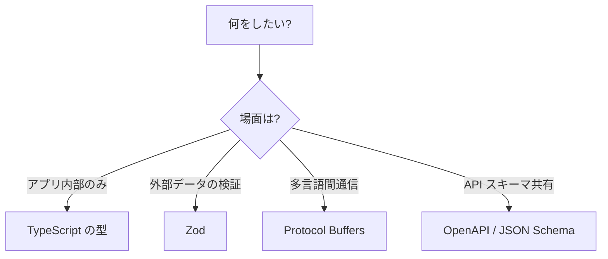

# 型システムの主要技術

## ドキュメント概要

このドキュメントでは、データに型・構造・制約を与える代表的な技術として、TypeScript の型、Zod、Protocol Buffers の 3 つを取り上げ、それぞれの特徴と使い分けを整理します。具体的には以下の内容を扱います。

- TypeScript の型システムの特徴と弱点 (構造的型付け、コンパイル時のみ)
- Zod による実行時バリデーション (Single Source of Truth、型推論)
- Protocol Buffers のバイナリシリアライゼーションとスキーマ言語
- 3 つの技術の比較と使い分けの目安
- 類似ライブラリ・技術の紹介

データに型・構造・制約を与える代表的な仕組みとして、**TypeScript の型**, **Zod**, **Protocol Buffers** があります。それぞれ立ち位置が異なるので、整理しながら見ていきます。

## 全体像



---

## TypeScript の型

JavaScript に静的型付けを足した言語です。

### 基本例

```typescript
interface User {
  id: number;
  name: string;
  email?: string;          // オプショナル
  role: "admin" | "user";  // リテラル型のユニオン
}

const user: User = {
  id: 1,
  name: "Alice",
  role: "admin"
};
```

### 特徴

- **構造的型付け (structural typing)**: 名前ではなく構造で型の互換性を判断する。同じ形のオブジェクトリテラルは、その型を期待する場所に渡せる。Java や Rust のような公称型 (nominal typing) とは逆。
- **コンパイル時のみ**: `tsc` で JavaScript にトランスパイルされる時点で型情報は完全に消える。実行時には何の保護もない。
- **高度な型操作**: `Pick`, `Omit`, `Partial`, `Readonly`, `keyof`, `typeof`, Mapped Types, Conditional Types, Template Literal Types など、型レベルの計算が強力。

### JSON との関係での弱点

外部から `JSON.parse()` で受け取ったデータは、本来 `unknown` (古くは `any`) です。型を付けても **それは嘘の可能性がある** のがポイントです。

```typescript
const data: User = JSON.parse(response); // コンパイルは通るが実行時の保証はゼロ
```

ここで Zod のような **実行時バリデーション** の出番になります。

---

## Zod

**TypeScript ファーストのランタイムバリデーションライブラリ**です。スキーマを書くと、バリデーションと型推論の両方が手に入ります。

### 基本例

```typescript
import { z } from "zod";

const UserSchema = z.object({
  id: z.number().int(),
  name: z.string().min(1),
  email: z.string().email().optional(),
  role: z.enum(["admin", "user"]),
});

// スキーマから TypeScript の型を自動生成
type User = z.infer<typeof UserSchema>;

// 実行時バリデーション
const result = UserSchema.safeParse(jsonData);
if (result.success) {
  const user: User = result.data; // 型安全
} else {
  console.error(result.error.issues);
}
```

### 強み

- **Single Source of Truth**: スキーマを一度書けば、型定義もバリデーションも両方得られる。型とバリデーションのズレが起きない。
- **TypeScript との統合が自然**: 型推論が強力で、IDE 補完がよく効く。
- **合成と変換**: `.transform()`, `.refine()`, `.pipe()` でパース後の変換やカスタムバリデーション。
- **エラーが扱いやすい**: `safeParse` で例外を投げずに結果を返す。

### 主な用途

| 用途 | 説明 |
|---|---|
| API 検証 | リクエスト/レスポンスの形式チェック |
| フォーム | react-hook-form などとの組み合わせ |
| 環境変数 | `process.env` を型付き設定オブジェクトに変換 |
| ストレージ | LocalStorage / IndexedDB から読み込んだデータの検証 |

### 類似ライブラリ

- **Valibot**: より軽量
- **Yup**: 古参のバリデータ
- **io-ts**: 関数型寄り
- **ArkType**: 高速・型レベルでの推論
- **TypeBox**: JSON Schema 互換

近年は **Zod** がデファクトスタンダードに近い位置にあります。

---

## Protocol Buffers (protobuf)

Google が開発した **バイナリシリアライゼーション形式 + スキーマ言語** です。JSON とは思想が大きく異なります。

### 基本例

`.proto` ファイルでスキーマを定義します。

```protobuf
syntax = "proto3";

message User {
  int32 id = 1;
  string name = 2;
  optional string email = 3;
  Role role = 4;
}

enum Role {
  ROLE_UNSPECIFIED = 0;
  ADMIN = 1;
  USER = 2;
}
```

`= 1`, `= 2` は **フィールド番号** で、バイナリ上でフィールドを識別するためのものです。一度割り当てたら変更してはいけません。

### ワークフロー



スキーマから各言語のコードを生成し、それを使ってデータをシリアライズ/デシリアライズします。

### JSON との比較

| 観点 | JSON | Protocol Buffers |
|---|---|---|
| 形式 | テキスト | バイナリ |
| サイズ | 大きい | 小さい (3〜10 倍コンパクト) |
| 速度 | 遅い | 速い |
| スキーマ | なし (JSON Schema で外付け) | 必須・組み込み |
| 人間可読 | ◎ | ✗ |
| 後方互換 | 自前で管理 | フィールド番号で言語的に担保 |
| 言語間共有 | パース処理を各言語で書く | スキーマからコード自動生成 |

### 主な用途

- **gRPC** の通信フォーマット (マイクロサービス間通信のデファクト)
- ストレージや高頻度通信での容量・速度最適化
- 多言語間でスキーマを共有したいシステム

### 弱点

- ブラウザでは扱いづらい (gRPC-Web や connect-es などのラッパーが必要)
- デバッグしづらい (バイナリなので curl で覗けない)
- スキーマのバージョン管理を真面目にやる必要がある

### 類似技術

- **FlatBuffers**: Google 製、ゼロコピーデシリアライズ
- **Cap'n Proto**: 同じく高速バイナリ形式
- **Apache Avro**: スキーマ進化に強い
- **MessagePack**: バイナリ JSON 的な位置付け
- **Bincode**: Rust エコシステム向け

---

## 使い分けの目安

| やりたいこと | 適した選択肢 |
|---|---|
| アプリ内の型表現だけ | TypeScript の型のみ |
| 外部境界 (API、フォーム、ストレージ) の実行時検証 | Zod |
| REST API 仕様の共有・ドキュメント化 | OpenAPI (JSON Schema ベース) |
| マイクロサービス間の高速・型安全な通信 | Protocol Buffers + gRPC |
| 言語横断でスキーマを共有 | Protocol Buffers / JSON Schema |

## まとめ



これら 4 つは排他的ではなく、組み合わせて使うのが普通です。例えば、

- TypeScript の型 + Zod で API 境界を守る
- OpenAPI + JSON Schema で API 仕様を共有し、そこから TypeScript 型を生成
- Protocol Buffers でマイクロサービス間、JSON で外部公開 API

といったハイブリッド構成がよく見られます。

→ スキーマと型の概念的な違いについては `schema_vs_type.md` を参照。
