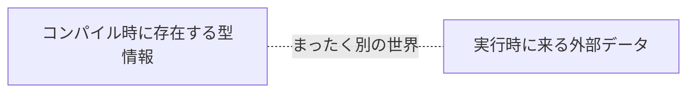
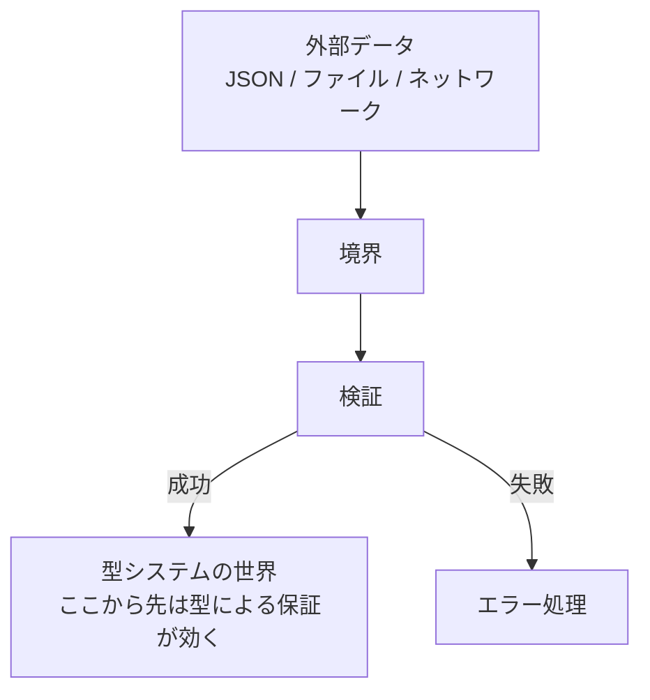
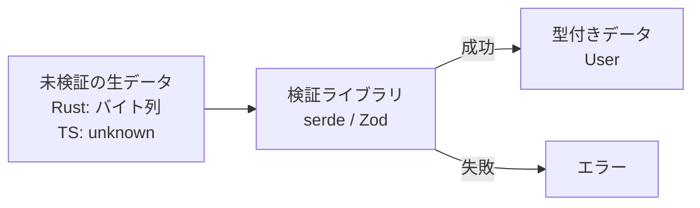
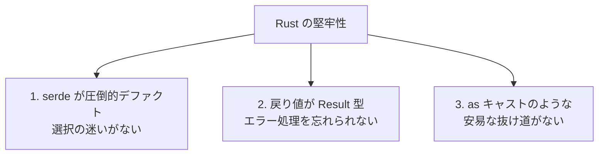

# 外部入力に対する型システムの堅牢性

## ドキュメント概要

このドキュメントでは、「実行時に外部から入ってくるデータに対して、言語の型システムはどう振る舞うか」という問いを掘り下げます。具体的には以下の内容を扱います。

- コンパイル時の型は、実行時の外部データを直接守れないという物理的事実
- Rust も TypeScript も、外部データの検証にはサードパーティライブラリが必要であること
- 「標準ライブラリ」と「事実上の標準 (de facto standard)」の違い
- 堅牢性を生むのは型システム単体ではなく、ライブラリと言語機能の組み合わせ
- Rust + serde と TypeScript + Zod の構造的な共通点と違い

## 大前提: コンパイル時の型は実行時の外部データを守れない

これは Rust でも TypeScript でも同じ物理的制約です。



コンパイル時の型チェックは、コンパイラがソースコードを見て行うものです。実行時に来るデータ (JSON、ファイル、ネットワーク入力) は、コンパイル時点では存在しないので、型チェックの対象になりえません。**この物理的事実は言語によらず同じです**。

つまり、

- TypeScript の型「だけ」では、外部からの入力に対して無力
- Rust の型「だけ」でも、外部からの入力に対して無力

両方とも同じです。

## では何が違うのか

違うのは、**外部データを言語の型システムの世界に取り込む仕組み**をどう用意しているか、です。

### 外部データを扱う流れ



この「境界での検証」をどう実現するかが、言語ごとに違います。

## 重要な誤解の訂正

ここは混乱しやすいポイントなので、明確にしておきます。

> Rust は標準ライブラリで外部データを検証できる

→ **これは誤解です**。

**Rust も TypeScript も、外部データの検証にはサードパーティライブラリが必要です**。

| 言語 | 標準ライブラリだけで外部データ検証できるか | 実際に使われるライブラリ |
|---|---|---|
| Rust | できない | serde (サードパーティ) |
| TypeScript | できない | Zod など (サードパーティ) |

**両方ともライブラリに依存する**という点では同じです。

## 「標準ライブラリ」と「事実上の標準」

ここで用語を整理しておきます。

| 用語 | 意味 | 例 |
|---|---|---|
| 標準ライブラリ (standard library) | 言語に組み込まれていて、追加インストールなしで使えるもの | Rust の `std`、Python の `json` モジュール |
| 事実上の標準 (de facto standard) | 標準ライブラリではないが、ほぼ全員が使うもの | Rust の serde、JavaScript の React など |

**Rust の標準ライブラリ (`std`) に JSON パーサーは含まれていません**。これは Python (`import json` で済む) や Go (`encoding/json` が標準) と対照的です。

Rust で JSON を扱うには、`Cargo.toml` に serde を追加する必要があります。

```toml
[dependencies]
serde = { version = "1", features = ["derive"] }
serde_json = "1"
```

TypeScript で Zod を入れるのと同じく、依存を追加する手間は発生します。

## では本当の違いは何か

「ライブラリに依存するかどうか」ではなく、**そのライブラリがどれだけ言語文化に深く根付いているか**、そして**言語機能とどう連動するか**が違いの本質です。

### Rust + serde の場合

```rust
use serde::Deserialize;

#[derive(Deserialize)]
struct User {
    id: u32,
    name: String,
    email: String,
}

let json = r#"{"id": "abc", "name": "Alice"}"#;
let user: User = serde_json::from_str(json)?;
// ↑ id が文字列なのでエラー、email も欠けてるのでエラー
```

ポイントは:

1. **`from_str` の戻り値が `Result<User, Error>` 型**になっている
2. つまり「失敗するかもしれない」ことが型で表現される
3. 失敗を処理しないとコンパイルが通らない
4. 成功した時点で、データは確実に `User` の構造になっている

### TypeScript + Zod の場合

```typescript
import { z } from "zod";

const UserSchema = z.object({
  id: z.number(),
  name: z.string(),
  email: z.string(),
});

const result = UserSchema.safeParse(jsonData);
if (result.success) {
  const user = result.data; // 型安全
} else {
  console.error(result.error);
}
```

仕組みとしては Rust + serde と **本質的に同じ** です。

### 構造的な共通点

両者とも、



という構造です。「未検証の世界」から「型システムの世界」への橋を、ライブラリが架けています。

## 実際の違い

仕組みは同じでも、以下の点で違いがあります。

| 観点 | Rust + serde | TypeScript + Zod |
|---|---|---|
| 標準的か | 事実上の標準、ほぼ全員が使う | 一部のプロジェクトで使う、使わない選択も普通 |
| 言語との統合 | `#[derive(Deserialize)]` という言語機能で struct から自動生成 | スキーマを別途定義、`z.infer` で型を生成 |
| 抜け道 | 基本的にない (外部データは serde を通すしかない) | `JSON.parse` + `as` で簡単に回避可能 |
| 失敗の表現 | `Result<T, E>` で型に現れる、無視できない | スキーマを呼ばなければそもそも検証されない |
| 選択肢 | serde が圧倒的にデファクト | Zod, Valibot, Yup, io-ts など複数 |

## なぜ Rust の方が堅牢に「見える」のか

これまでの整理から、Rust が堅牢に見える理由は次の 3 点に分解できます。



| 要素 | 種類 |
|---|---|
| 1. serde がデファクトであること | **エコシステムの特性** |
| 2. `Result<T, E>` でエラー処理を強制すること | **言語機能** |
| 3. 安易な型キャストの抜け道がないこと | **言語仕様** |

**1 はエコシステム、2 と 3 は言語自体の特性**です。

これらが組み合わさることで、「外部データを扱うときは必ず検証が走り、結果のエラー処理も必須」という構造が自然に生まれます。

## TypeScript で同等の堅牢性を得るには

TypeScript でも同等の堅牢性は達成可能ですが、**規律と意識的な導入が必要**です。

1. Zod (または同等のライブラリ) を導入する
2. すべての境界で必ず検証を通す
3. `as` キャストを使わない (eslint ルールなどで禁止)
4. 検証結果の成功/失敗を必ず処理する

これらを**チームで意識して徹底する必要があります**。言語が強制してくれないので、規律で守る形になります。

## より正確な言い方

「Rust は外部入力に対して堅牢」というのは、

- ❌ Rust の型システムが、実行時のデータを直接チェックする
- ⭕ Rust のエコシステムが、外部データを型システムの世界に持ち込む際に必ず検証を強制する文化を持つ

という意味です。

これは TypeScript と Zod の組み合わせで同等のことが達成可能です。

> **「Rust の型システムが内在的に強力」というより、「Rust のエコシステムが外部境界の扱いに規律を持ち込んでいる」**

と捉えるのが正確です。

## 整理: 境界での検証の有無による違い

| | 境界での検証 | 強制の方法 |
|---|---|---|
| Rust + serde | serde が事実上標準で行う | 言語的・文化的に強制 |
| TypeScript + Zod | Zod が行う | プロジェクトの規律で強制 |
| TypeScript のみ | 行われない (もしくは手書きで部分的に) | 強制なし |

## まとめ

### 物理的事実

コンパイル時の型は、定義上、実行時のデータを直接守ることはできません。これはどの言語でも同じです。

### 堅牢性を生むもの

堅牢性を生むのは、**境界での検証 + 検証結果を型システムに繋ぐ仕組み** です。

- Rust: serde + `Result<T, E>` で、この仕組みが言語文化に深く組み込まれている
- TypeScript: Zod などで実現できるが、規律と意識的な導入が必要

### 違いの本質

「Rust の方が外部入力に堅牢」というのは、

- 言語の本質的な能力差ではなく
- **エコシステムの設計と文化の差**

である。TypeScript でも同等の堅牢性は達成可能だが、言語が手伝ってくれる度合いが違う。

### 共通の構造

仕組みとしては、Rust + serde と TypeScript + Zod は **本質的に同じ** です。両者とも、

1. 外部データを受け取る
2. ライブラリで検証する
3. 成功すれば型システムの世界に入る
4. 失敗すればエラー処理に回る

という流れで、「未検証の世界」と「型システムの世界」を分けています。違いはこの仕組みがどれだけ言語的に・文化的に強制されるかという点にあります。
