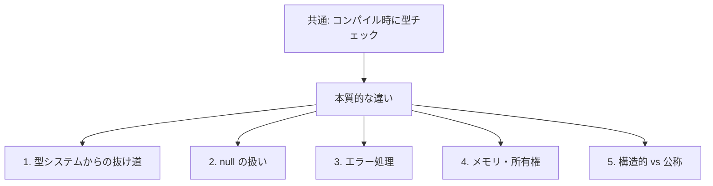
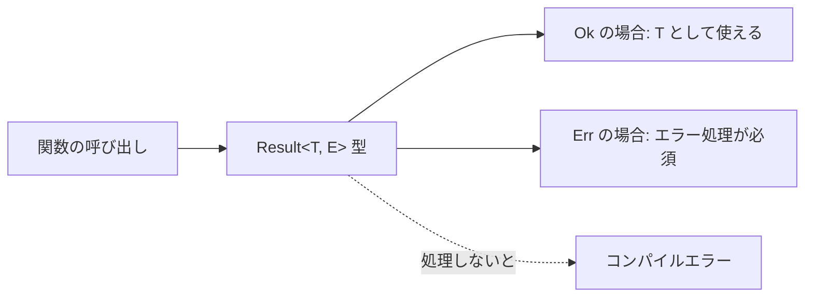
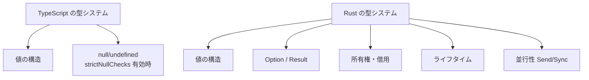

# Rust と TypeScript の型チェックの違い

## ドキュメント概要

このドキュメントでは、「Rust と TypeScript はどちらもコンパイル時に型チェックを行うのに、なぜ Rust の方が厳密と言われるのか」という疑問を掘り下げます。具体的には以下の内容を扱います。

- 両者の表面的な共通点 (コンパイル時の型チェック)
- 本質的な違い 1: 型システムの抜け道の存在と扱い
- 本質的な違い 2: null と Option<T> の扱い
- 本質的な違い 3: エラー処理の型による表現
- 本質的な違い 4: メモリと所有権を型で表現するかどうか
- 本質的な違い 5: 構造的型付けと公称型
- 言語設計の思想の違い (漸進的型付け vs ゼロからの型安全性)

## はじめに: 表面的には同じに見える

両者には共通点があります。

- どちらもコンパイル時に型チェックを行う
- 型エラーがあるとビルドが通らない
- 実行時には型情報が消える (機械語/JavaScript には型は残らない)

これだけ見ると「型チェックは同じ」に見えます。しかし、いくつか本質的な違いがあります。

## 違いの全体像



---

## 違い 1: 型システムの抜け道

これが最も大きな違いです。TypeScript は JavaScript との互換性を最優先しているため、**型システムから逃げ出す手段が言語に組み込まれています**。

### TypeScript の抜け道

#### `any` 型

```typescript
let x: any = "hello";
x = 42;
x = { foo: "bar" };
x.someMethod(); // コンパイル通る、実行時に死ぬ
```

`any` を使うと型チェックを完全に無効化できます。

#### 型アサーション `as`

```typescript
const data = JSON.parse(response) as User;
// コンパイラ「了解、これは User 型として扱います」
// 実行時「中身が User とは限らないが知らん」
```

#### 非 null アサーション `!`

```typescript
const el = document.getElementById("foo")!;
// 「null じゃないよ、信じて」とコンパイラに伝える
// 実行時に null だったらクラッシュ
el.textContent = "hello"; // Cannot read properties of null
```

### Rust の抜け道

Rust にも抜け道は存在しますが、扱いが大きく違います。

```rust
unsafe {
    // 危険な操作 (生ポインタの逆参照、メモリの再解釈など)
}
```

| 観点 | TypeScript の `any` / `as` / `!` | Rust の `unsafe` |
|---|---|---|
| 書きやすさ | 1 文字や数文字で書ける | `unsafe` ブロックが必要 |
| 使われる頻度 | 日常的に使われる | 限定的な場面のみ |
| レビュー文化 | 特に意識されないことも多い | 「なぜ unsafe が必要か」が問われる |
| 言語的なシグナル | 明示的な「危険」マークはない | 明確に「ここから先は危険」 |

**型システムを抜けることが、言語的にも文化的にも面倒**になっているのが Rust の特徴です。

---

## 違い 2: null と Option<T> の扱い

### TypeScript の場合

```typescript
function findUser(id: number): User | null {
  // ...
}

const user = findUser(1);
console.log(user.name); // コンパイルエラー (strictNullChecks が有効なら)
```

`strictNullChecks` を有効にすれば、null チェックを忘れることはエラーになります。これは Rust と同等に見えます。

ところが:

```typescript
const user = findUser(1)!;  // ← これで通ってしまう
console.log(user.name);     // null だったら実行時クラッシュ
```

非 null アサーションで簡単に逃げられます。さらに、**`strictNullChecks` を有効にしていないコードベースも存在する**ため、null がそもそも型に現れない場合もあります。

### Rust の場合

```rust
fn find_user(id: u32) -> Option<User> {
    // ...
}

let user = find_user(1);
println!("{}", user.name); // コンパイルエラー、Option<User> に name はない
```

**null そのものが存在しません**。null になりうる値は `Option<T>` という型で包む必要があり、中身を取り出すには **必ず分岐処理が必要** です。

```rust
match find_user(1) {
    Some(user) => println!("{}", user.name),
    None => println!("見つからない"),
}
```

抜け道として `unwrap()` がありますが:

```rust
let user = find_user(1).unwrap(); // None なら panic で停止
```

これは「ここで失敗したらクラッシュさせる」と明示的に書く必要があり、コードレビューで必ず注目されます。

### 比較

| 観点 | TypeScript | Rust |
|---|---|---|
| null の扱い | 言語に組み込み | 言語に存在しない |
| null チェックの強制 | `strictNullChecks` オプション次第 | 言語仕様レベルで強制 |
| 抜け道 | `!` (非 null アサーション) | `unwrap()` (明示的 panic) |
| デフォルトの厳密さ | プロジェクト設定次第 | 常に厳密 |

---

## 違い 3: エラー処理が型で表現される

### TypeScript の場合

```typescript
function parseConfig(text: string): Config {
  // 内部で JSON.parse が例外を投げる可能性がある
  // でも、関数のシグネチャからはそれが分からない
}

const config = parseConfig(text); // 例外処理しなくてもコンパイル通る
```

例外が投げられるかどうかは型に現れません。try/catch を書き忘れても、コンパイラは何も言いません。**「失敗する可能性」が型システムの外にある**。

### Rust の場合

```rust
fn parse_config(text: &str) -> Result<Config, ParseError> {
    // ...
}

let config = parse_config(text); // Result<Config, ParseError> 型
config.name; // コンパイルエラー、Result 型に name はない
```

成功か失敗かを表す `Result<T, E>` 型で包まれているので、**失敗の可能性を必ず処理しなければコンパイルが通らない**。

```rust
match parse_config(text) {
    Ok(config) => println!("{}", config.name),
    Err(e) => eprintln!("エラー: {}", e),
}
```



| 観点 | TypeScript の例外 | Rust の Result |
|---|---|---|
| 失敗の表現 | 型に現れない (try/catch) | 型に現れる (`Result<T, E>`) |
| 処理の強制 | 強制されない | コンパイラが強制 |
| 忘れたときの挙動 | 実行時にクラッシュ | コンパイル時にエラー |

---

## 違い 4: メモリと所有権の型による表現

これは TypeScript には**存在しない領域**です。

```rust
fn take_user(user: User) {
    // user はここに「所有権が移動」する
}

let u = User { name: "Alice".to_string() };
take_user(u);
println!("{}", u.name); // コンパイルエラー、u は既にムーブされている
```

Rust は「この値を誰が所有しているか」「いつ解放されるか」「並行アクセスして安全か」を**すべて型レベルで表現する**。

これはガベージコレクタがある JavaScript/TypeScript では考慮する必要がない領域です。

つまり、**Rust の型システムが対象とする領域そのものが広い**。



---

## 違い 5: 構造的型付け vs 公称型

これも厳密さに関わる違いです。

### TypeScript (構造的型付け)

```typescript
interface Meter { value: number }
interface Foot { value: number }

function setHeight(h: Meter) { /* ... */ }

const foot: Foot = { value: 100 };
setHeight(foot); // コンパイル通る! 構造が同じだから
```

同じ構造なら互換性がある、と判断されます。意図的に区別したい型でも、構造が同じだとコンパイラが見分けてくれません。

### Rust (公称型)

```rust
struct Meter { value: f64 }
struct Foot { value: f64 }

fn set_height(h: Meter) { /* ... */ }

let foot = Foot { value: 100.0 };
set_height(foot); // コンパイルエラー、型の名前が違う
```

「Meter と Foot は別物」と言語が認識します。NASA の Mars Climate Orbiter 事故 (フィートとメートルの取り違えで探査機を喪失) のようなミスを型レベルで防げます。

TypeScript でも `branded types` というテクニックでこれをエミュレートできますが、Rust では標準的な書き方の中で自然に得られます。

---

## 比較表

| 観点 | TypeScript | Rust |
|---|---|---|
| 型チェックの実施 | コンパイル時 | コンパイル時 |
| 型システムからの抜け道 | `any`, `as`, `!` が日常的 | `unsafe` (明示的・限定的) |
| null の扱い | null/undefined あり (設定で厳格化可能) | null 自体が存在しない、`Option<T>` |
| エラー処理 | 例外 (型に現れない) | `Result<T, E>` (型に現れる) |
| メモリ・所有権 | 型システムの対象外 | 型システムで管理 |
| 構造的 vs 公称 | 構造的 | 公称 |
| コンパイル後の型情報 | 完全に消える | 消える (が、消える前の保証が強い) |

---

## 言語設計の思想の違い

「Rust の方が厳密」というのは、言語の優劣ではなく**設計思想の違い**から来ています。

### TypeScript: 漸進的型付け (gradual typing)

TypeScript には「漸進的型付け」という設計思想があります。**「型なしの JavaScript コードと、型付きの TypeScript コードが混在できる」** ことが前提。だから `any` のような抜け道が必要だった。これは欠陥ではなく **設計上の選択** です。

### Rust: 最初から型による安全性

Rust は「最初から全部型をつける」前提なので、漸進的である必要がない。だから抜け道を限定できます。

### 解決したい問題が違う

| 言語 | 解決したい問題 |
|---|---|
| TypeScript | 既存の JavaScript エコシステムに型安全性を追加したい |
| Rust | ゼロから、メモリ安全で並行性も安全な言語を作りたい |

なので「どちらが優れている」ではなく「目的が違う」と捉えるのが公平です。ただ「厳密さ」という一点で見れば、Rust の方が圧倒的に厳密、と言えます。

## まとめ

「両方ともコンパイル時に型チェックする」は正しい。違いは型システムの **強度** と **カバー範囲** です。

### TypeScript

JavaScript の上に「あとから型を貼り付けた」言語。型システムには故意の抜け穴があり、null・例外・外部データなど、型でカバーしない領域も多い。**型を厳密に使おうとすれば厳密にできるが、緩く使うこともできる**。

### Rust

ゼロから「型で安全性を担保する」前提で設計された言語。抜け道は意図的に書きにくくしてあり、メモリ・所有権・エラー処理まで型でカバーする。**型を緩く使うほうが難しい**。

つまり「Rust の方が厳密」というのは、

1. 型システムが扱う領域が広い
2. 抜け道が少なく、使う際の心理的コストが高い
3. 「うっかり型をすり抜ける」ことが構造的に起きにくい

という意味です。コンパイル時にチェックするという仕組みは同じでも、**そのチェックがどこまでカバーしているか、どれだけ厳格に強制されるか**が大きく違うのです。
