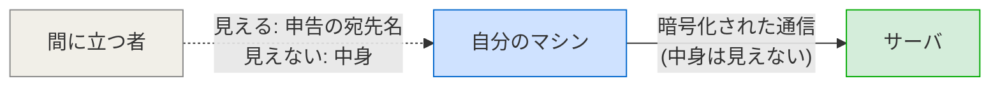
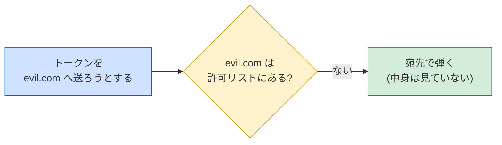
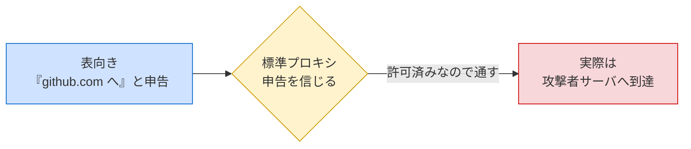
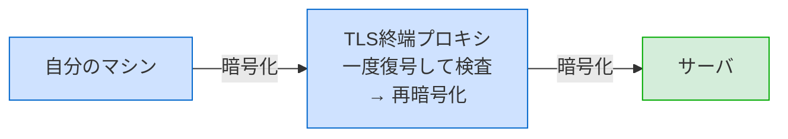
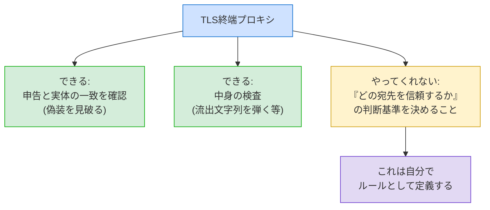

# TLS終端プロキシ 勉強ノート

学習用メモ（標準プロキシとの違い／何ができて何ができないか）

---

## このノートの狙い

sandbox の egress制限を調べる中で出てきた「TLS終端プロキシ」を、自分の言葉で理解するためのノート。
押さえたい問いは3つ:

1. そもそも標準プロキシは何を見て判定しているのか
2. TLS終端プロキシを入れると何が変わるのか
3. それで「信頼できる宛先かどうか」を判定できると言ってよいのか

結論を先に:

- 標準プロキシは**宛先の自己申告**しか見られない（中身は暗号で見えない）。
- TLS終端プロキシは**封を開けて中身と本当の宛先**を確認できる → **申告の偽装を見破れる**。
- ただし「どの宛先を信頼するか」のルールは**自分で定義する**必要がある。プロキシはそのルールを正確に適用する道具であって、信頼判定を代行はしない。

---

## 1. 前提：TLS（HTTPS）は中身を隠す

TLS は HTTPS通信の暗号化の仕組み。マシンとサーバの間の通信内容を、第三者が覗いても読めないように暗号化する。

ポイントは、**間に立つ者には中身が見えない**こと。見えるのは「どこへ繋ごうとしているか（申告された宛先ホスト名）」くらいで、データの中身は暗号の中に隠れる。

---

## 2. 標準プロキシ：表書きだけ見る検問所

sandbox のネットワーク制限は、箱の外のプロキシが「この宛先は許可リストにあるか」を判定して通す／弾く仕組み。
標準プロキシは **TLSを終端しない**（＝暗号をほどかない）ので、判定材料が限られる。

| 標準プロキシが見るもの | 見ないもの |
|------------------------|------------|
| 「github.com に繋ぐ」という**自己申告の宛先名** | 通信の**中身**（何を送るか） |
| | **本当にその宛先に繋がっているか** |

→ 申告された宛先を**額面どおり信じるしかない**。

### たとえ

> 中身の見えない封筒に「宛先：GitHub」と書いてある。
> 検問所（標準プロキシ）は封を開けないので、表書きを信じて通すしかない。

### 健全に動けば、これでも持ち出しは防げる

中身を見なくても、「**許可した宛先にしか通信させない**」ことで持ち出しを防ぐのが本来の効き方（egress制限）。

---

## 3. 標準プロキシの落とし穴：宛先の偽装

問題は「中身が見えないから検知できない」ことではなく、**宛先の申告そのものを偽装される**こと。
プロキシは中身を見ないので申告を信じるしかなく、許可済みの `github.com` を表向き名乗りつつ実際は別サーバへ届ける手法（domain fronting 等）ですり抜けられる。

### たとえ（続き）

> 封筒の表書きは「GitHub」。でも中の本当の指示書には別の住所が書いてある。
> 検問所は封を開けない（＝TLSを検査しない）ので、これを見破れない。

### だから「広いドメイン許可は危険」

危険な経路は2種類。根は同じ（プロキシは宛先の申告を信じるしかない）。

| 経路 | 内容 |
|------|------|
| 直接的 | 許可リストを広げすぎ、その範囲に攻撃者のホストが紛れ込む |
| 間接的 | 正規の宛先しか許可していなくても、申告の偽装で迂回され攻撃者サーバへ届く |

→ 許可ドメインを絞るほど「名乗って通れる宛先」が減り、すり抜けの土俵が小さくなる。

---

## 4. TLS終端プロキシ：封を開ける検問所

TLS終端プロキシは、暗号を**一度ほどいて中身を見て**、再び暗号化して転送する。
（自分が正規の「中間者(MITM)」になる構成。だから後述のCA証明書が要る）

### 標準プロキシとの比較

| | 標準プロキシ | TLS終端プロキシ |
|---|---|---|
| 判定材料 | 申告された宛先名のみ | **実際の宛先・中身** |
| 宛先の偽装(domain fronting) | 見破れない | **見破れる** |
| 中身での検査(トークン流出を弾く等) | 不可 | **技術的に可能(DLP的)** |
| 導入コスト | 低（標準で同梱） | 高（CA証明書の導入等） |
| 位置づけ | まず使う標準手段 | 標準で足りない脅威モデル向け |

---

## 5. 重要な誤解の整理：「信頼できる宛先か」を判定してくれる？

ここが今回いちばん腑に落ちた点。**半分正しく、半分は補足が要る**。

### 正しい部分

TLS終端プロキシは、中身を見られるので「**申告された宛先が本当にその宛先なのか（偽装されていないか）**」を確認できる。→ domain fronting のような偽装を見破れる。

### 補足が要る部分

TLS終端プロキシが自動でやってくれるのは「**申告と実体が一致しているか**」の確認まで。
「**その宛先が信頼に値する相手か**」を決めるのは、結局**自分が書く許可ルール（ポリシー）**。

### たとえ（まとめ）

> 標準プロキシ … 封筒の表書きだけ見る検問所
> TLS終端プロキシ … 封を開けて中身と本当の宛先まで確認する検問所
>
> ただし「この宛先は通してよい相手か」という**判断基準（許可リスト）は検問所に渡しておく**必要がある。
> 開封できること自体が信頼判定をしてくれるわけではなく、**正しい判定の前提条件を満たすにすぎない**。

→ 一言で言うと：「TLS終端プロキシを入れれば、**申告の偽装を見破ったうえで、自分が定めた信頼ルールを正確に適用できる**ようになる」。
「信頼できる宛先かを確認できる」は、その信頼基準を自分で与えることが前提。

---

## 6. 実務上の注意

- TLS終端プロキシは中身を覗く＝自分で正規にMITMを行う構成。導入には**プロキシのCA証明書を sandbox 内にインストール**する必要がある。
- 強力な反面、設定を誤ると別のリスク源にもなりうる。「標準プロキシで足りない脅威モデルのとき」に踏み込む位置づけが妥当。
- 多くのケースでは、まず以下のほうが費用対効果が高い:
  1. **許可ドメインを最小化**する（信じる相手を減らす）
  2. **緩和策（最小権限・短命トークン）を併用**する（すり抜けられても困らないようにする）

---

## 7. 一枚にまとめ

| 観点 | 要点 |
|------|------|
| 標準プロキシの守り | 「宛先の申告」を信じて、許可した宛先にしか通信させない |
| その弱点 | 中身を見ないので、申告（宛先）の偽装を見破れない |
| 広いドメインが危険な理由 | 「名乗って通れる宛先」が増え、すり抜けの土俵が広がる |
| TLS終端プロキシの価値 | 偽装を見破り、中身検査もできる＝信頼ルールを正確に適用できる |
| ただし | 「何を信頼するか」は自分で定義する。プロキシは代行しない |
| 優先順位 | まず許可ドメイン最小化＋緩和策。足りなければTLS終端プロキシ |

### 守りの軸はひとつ

すべては「**プロキシは宛先を信じるしかない**」という一点から出発している。
だから対策も「その宛先の信頼をどう担保するか」に集約される:

- 信じる相手を減らす（許可ドメイン最小化）
- 申告の偽装を見破る（TLS終端プロキシ）
- 信じた相手が裏切っても困らないようにする（最小権限・短命トークン）
